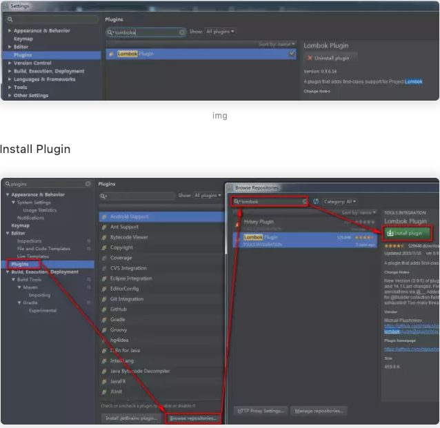
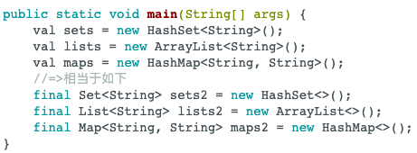
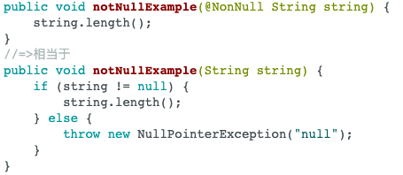
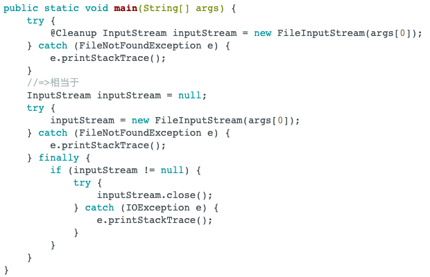
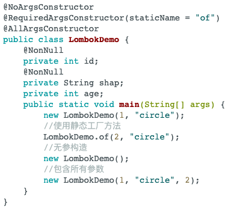
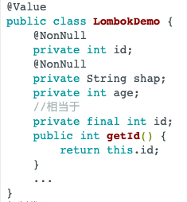
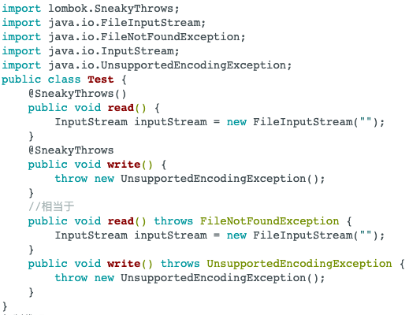
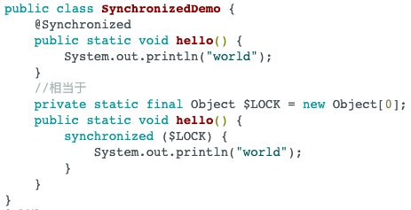

### 简介
Lombok是一款好用顺手的工具，可用来帮助开发人员消除Java的冗长代码，尤其是对于简单的Java对象（POJO）。它通过注释实现这一目的。通过在开发环境中实现 Lombok，开发人员可以节省构建诸如hashCode()和equals()这样的方法以及以往用来分类各种accessor和mutator的大量时间。

Lombok主要为Java提供了不少语法糖，其中很多的设计都符合《Effective Java》所描述的Java编程最佳实践。Lombok 的学习成本很低，几乎可以直接上手，**但是在团队开发的时候要注意，如果团队开发要使用这种工具一定要沟通好，团队其它人不一定装了这个插件。**
### 安装
通过IntelliJ的插件中心安装

在使用lombok注解的时候记得要导入lombok.jar包到工程，如果使用的是Maven Project，要在pom.xml中添加依赖。

### Lombok常用注解详解
- val：用在局部变量前面，相当于将变量声明为final

- @NonNull：给方法参数增加这个注解会自动在方法内对该参数进行是否为空的校验，如果为空，则抛出NPE（NullPointerException）

- @Cleanup：自动管理资源，用在局部变量之前，在当前变量范围内即将执行完毕退出之前会自动清理资源，自动生成try-finally这样的代码来关闭流。虽然自JDK7以来，原生引入了try--with--resource结构，但还是不如@Cleanup来的简洁。

- @Getter/@Setter：用在属性上，再也不用自己手写setter和getter方法了，还可以指定访问范围。

- @ToString：用在类上，可以自动覆写toString方法，当然还可以加其他参数，例如@ToString(exclude=”id”)排除id属性，或者@ToString(callSuper=true, includeFieldNames=true)调用父类的toString方法，包含所有属性

- @EqualsAndHashCode：用在类上，自动生成equals方法和hashCode方法

- @NoArgsConstructor, @RequiredArgsConstructor and @AllArgsConstructor：用在类上，自动生成无参构造和使用所有参数的构造函数以及把所有@NonNull属性作为参数的构造函数，如果指定staticName = “of”参数，同时还会生成一个返回类对象的静态工厂方法，比使用构造函数方便很多


- @Data：注解在类上，相当于同时使用了@ToString、@EqualsAndHashCode、@Getter、@Setter和@RequiredArgsConstrutor这些注解，对于POJO类十分有用

- @Value：用在类上，是@Data的不可变形式，相当于为属性添加final声明，只提供getter方法，而不提供setter方法


- @Builder：用在类、构造器、方法上，为你提供复杂的builder APIs，让你可以像如下方式一样调用Person.builder().name("Adam Savage").city("San Francisco").job("Mythbusters").job("Unchained Reaction").build();
```
@Builder
public class BuilderExample {
    private String name;
    private int age;
    @Singular
    private Set<String> occupations;
    public static void main(String[] args) {
        BuilderExample test = BuilderExample.builder().age(11).name("test").build();
    }
}
```
- @SneakyThrows：自动抛受检异常，而无需显式在方法上使用throws语句

- @Synchronized：用在方法上，将方法声明为同步的，并自动加锁，而锁对象是一个私有的属性$lock或$LOCK，而java中的synchronized关键字锁对象是this，锁在this或者自己的类对象上存在副作用，就是你不能阻止非受控代码去锁this或者类对象，这可能会导致竞争条件或者其它线程错误

- @Getter(lazy=true)：可以替代经典的Double Check Lock样板代码
- @Log：根据不同的注解生成不同类型的log对象，但是实例名称都是log，有六种可选实现类：@CommonsLog @Log @Log4j @Log4j2 @Slf4j @XSlf4j 

