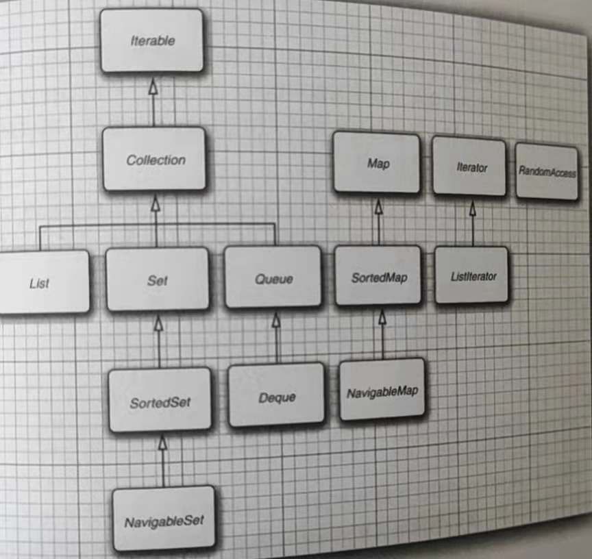

### Java的基本程序设计结构
#### 数据类型
##### 整型
- Java提供了4种整型:byte,short,int,long.
- Java中，整型的范围与运行Java代码的机器无关，而在C++中，int 和long等类型的大小与目标平台相关.
- 长整型有一个L或l后缀，十六进制有一个0X或0x前缀，八进制有一个0前缀，Java 7起，加上前缀0b或0B就可以写二进制数.
- Java没有任何无符号形式的int/long/short/byte.
##### 浮点类型
- float精度是6-7位有效数字，double精度是float的二倍
- float类型的数只有一个后缀F或f，没有后缀的浮点数默认为double
##### char类型
- 有些Unicode字符可用一个char值描述，另外一些需要两个
- char类型的字面量值要用单引号括起来
##### boolean类型
- Java中整型值和布尔值不能互相转换，在C++中，值0相当于false,非0值相当于true.
#### 变量与常量
- 变量名必须是一个以字母开头并由字母和数字组成的序列，不能使用保留字作为变量名
- 声明一个变量后，必须用赋值语句对变量进行显示初始化，变量的声明尽可能地靠近第一次使用的地方.
- Java 10 开始，对于局部变量，如果可以从变量的初始值推断出它的类型，就不需要声明类型。只需要使用关键字var而无需指定类型，如var greeting = "hello";则greeting是一个字符串
- 关键字final表示常量，一旦赋值就不能再更改了，通常，常量名使用全大写.
- 类常量的定义位于main方法的外部
#### 枚举类型
- 变量的取值只在一个有限的集合内时，可以定义枚举类型。如， enum Size {Small, Medium, Large};然后声明这种类型的变量:Size s = Size.Small.
#### 运算
- Math类中包含了各种数学函数，在文件顶部加入import static java.lang.Math.*;就可以直接使用方法，不必加前缀了
- 一个二元运算符连接两个值时，要先将两个操作数转为同一个数据类型，如果一个是double，另一个转换为double；否则如果一个是float，另一个会转为float;否则其中一个是long,另一个转为long；否则两个操作数都转为int
- 将double转为int这种会损失信息的转换需要通过强制类型转换完成，即在圆括号中给出想要转换的目标类型，比如
  double x = 9.999; int nx = (int)x;   
- 如果想要对浮点数进行舍入运算，需要使用Math.round方法。如，int nx = (int)Math.round(x);使用强制转换的原因是round返回的类型为long.
#### 字符串
- Java字符串就是Unicode字符序列，用双引号括起来.
- substring(0,3)表示提取0-3的子串，不包括位置3.
- Java字符串与一个非字符串的值拼接时，后者会转换为字符串
- 如果把多个字符串拼接在一起，并指定一个分隔符，可以使用join方法。如String all = String.join("/","S","M","L");
- 不能修改Java字符串中的单个字符
- 使用equals方法检测两个字符串是否相等，而不是使用==.
- 使用if(str.length()==0)或if(str.equals(""))判断空串
- 使用if(str == null)判断是否为null
- String的相关API在书50页
- 如果需要使用小段字符串来构建一个字符串，使用StringBuilder.
#### 输入与输出
- 读取控制台输入需要构造一个与"标准输入流"System.in关联的Scanner对象.Scanner in= new Scanner(System.in);
- nextLine方法将读取一行输入，nextInt读取一个整数，nextDouble读取下一个浮点数,next读取输入的下一个单词(以空格为分隔符),hasNext检测是否输入中还有其他单词.
- System.out.printf可以格式化输出，假如x = 3333.3333333，System.out.printf(%8.2f, x);表示以8个字符的宽度打印x，精度为小数点后2位。也就是说会打印一个前导空格和7个字符(3333.33).
- 每个以%字符开始的格式说明符都用相应的参数替换，常见的格式转换符有，d表示十进制数，x表示十六进制数，o表示八进制数，f表示定点浮点数，e表示指数浮点数，s表示字符串,c表示字符.
#### 控制流程
- 块(即复合语句)是指由若干条Java语句组成的代码块，并用一对大括号括起来.
- 条件语句if 
- 循环语句for,while
- 多重选择switch，switch(choice){case 1: ...break;default: ... break;};switch语句将从与选项值匹配的case标签开始，直到遇到break语句或到switch语句的结束处为止。如果没有匹配的case标签而有default字句，就执行这个语句.
- case标签可以是char/short/byte/int，枚举常量，Java 7开始还可以是字符串.
#### 大数
- 如果基本的整数和浮点数精度不能够满足需求，那么可以使用java.math中的BigInteger和BigDecimal。使用静态的valueOf方法可以将普通的数转为大叔，如BigInteger a = BigInteger.valueOf(100)；
- 不能使用算术运算符如+-*/处理大数，需要使用类中的方法，如add,multiply,divide等
#### 数组
- 声明，初始化，访问，for each循环遍历
- 如果希望将一个数组的所有值拷贝到一个新的数组，使用Arrays类的copyOf方法，第一个参数是源数组，第二个参数是新数组长度.
### 对象与类
##### 类之间的常见关系
- 依赖：use-a,一个类使用或者操作另一个类，就说一个类依赖于另一个类，应该尽可能将相互依赖的类减少，也就是降低类之间的耦合。
- 聚合：即has-a,一个类包含另一个类
- 继承：is-a,一个更特殊的类与一个更一般的类之间的关系。
##### 对象与对象变量
- 类的实例称为对象，要使用对象，必须要先构造对象并初始化，才能使用对象的方法.
- Date deadline = new Date();有两个部分： new Date构造了一个Date类型的对象，他的值是新创建对象的一个引用，这个引用存储在变量deadline中.
- 所有的Java对象都存储在堆中，当一个对象包含另一个对象变量时，只是包含着另一个堆对象的指针.

##### 构造器
- 构造器与类同名
- 每个类可以有一个以上的构造器
- 构造器可以有0个、1个或多个参数
- 构造器没有返回值
- 构造器总是伴着new 操作符一起使用
- 不要在构造器中定义与实例字段同名的局部变量,这些局部变量会屏蔽同名的实例字段.
##### 封装
如果想要获得或设置实例字段的值，那么只需要提供下面三项内容：

- 一个私有的数据字段
- 一个公共的访问字段的方法
- 一个公共的更改字段的方法
##### 基于类的访问权限
- 方法可以访问调用这个方法的对象的私有数据
- 一个方法可以访问所属类的所有对象的私有数据
- 在设计一个类时，由于公共数据非常危险，所以应该讲所有的数据字段都设置为私有的.
- 通常，为了实现某个公共接口的一些辅助方法，最好设计为私有
##### 静态字段与静态方法
- static修饰的字段，它属于类，不属于任何单个的对象；而非静态的实例字段，每个对象都有自己的一个副本.
- 静态变量使用的比较少，但在类中定义一个静态常量却很常用
- 静态方法不能访问实力字段，可以使用类名或者对象调用静态方法，但是建议使用类名来调用静态方法
- 可以使用静态工厂方法代替构造器来构造对象
##### 方法参数
- Java采用按值调用，也就是方法得到的是参数值的一个副本
- Java有两种类型的方法参数，基本数据类型(数字、布尔值)和对象引用，方法可以改变对象参数的内部状态但不能让一个对象参数引用一个新的对象
##### 对象构造
- 多个方法有相同的名字、不同的参数，就出现了重载
- Java允许重载任何方法，而不只是构造器方法。要完整描述一个方法，需要指定方法名以及参数，这叫方法的签名。
- 如果在构造器中没有显式为字段设置初值，就会被自动赋为默认值，数值为0，布尔为false,对象应用为null.方法中的变量必须明确初始化
- 如果写一个类时没有写构造器，那么JVM会提供一个无参构造器，这个构造器将所有的字段设置为默认值
- 如果类中提供了至少一个构造器但是没有提供无参构造器，那么构造对象时如果提供参数就是不合法的
- 可以直接在类定义中直接为任何字段赋值，在执行构造器之前会完成这个赋值操作。如果一个类的所有构造器都希望把某个字段设置为一个值，这个语法就很有用
- 如果构造器的第一语句形如this(...)，这个构造器将调用同一个类的另一个构造器
- 静态字段的初始化在类的第一次加载时执行，默认值是0、false或null.所有的静态字段和静态代码都按照类中声明的顺序执行
- 看书中132页的程序4-5，展示了本节的特性
#### 包
- Java允许使用包将类组织在一个集合中，使用包的主要原因是确保类名唯一性，同名类放在不同包中就不会产生冲突。
- 有一种import语句允许导入静态方法金额静态字段而不只是类，如import java.lang.System.*
- 没有指定public或private的类可以被同一个包中的所有方法访问
- 140页类路径
##### 类设计技巧
- 一定保证数据私有
- 一定要对数据进行初始化。可以提供默认值，也可以在所有的构造器中设置默认值
- 不用在类中使用过多的基本类型。用其他的类替换使用多个相关的基本类型，例如用一个Address类替换一个Customer类的地址相关的实例字段。
- 不是所有的字段都需要单独的字段访问器和字段更改器。如一些不需要或者不希望获得或设置的实例字段
- 分解有过多职责的类。看153页的例子
- 类名和方法名要能体现他们的指责。类名应当是一个名词(Order)或前面有形容词修饰的名词(RushOrder)或是有动名词修饰的名词(BillingAddress)。对于方法，遵循标准惯例。
- 优先使用不可变的类。如果类是不可变的，就可以安全地在多个线程间共享其对象。

## 继承
#### 超类和子类
##### 定义子类
- extends表明正在构造的新类派生于一个已存在的类，这个已存在的类称为超类或基类或父类，新类称为派生类或子类
- 子类比父类拥有的功能更多，在设计类时，把最一般的方法放在父类中，更特殊的方法放在子类，子类会自动基础父类中的方法
##### 覆盖方法
- 父类中的有些方法可能对子类并不一定适用，因此子类需要提供一个新的方法*覆盖*父类中的这个方法
- *super*关键字可以调用父类的某个方法
- 在覆盖一个方法时，子类方法不能低于父类方法的可见性
##### 子类构造器
- 语句super(name,salary)是"调用父类中带有name和salary参数的构造器"的简写形式
- 使用super调用构造器的语句必须是子类构造器的第一条语句
- 如果子类的构造器没有显式地调用父类的构造器，将自动调用父类的无参构造器，如果父类没有无参构造器，并且在子类的构造器中又没有显示地调用父类的其他构造器，则编译器会报告错误
##### 继承层次
- 由一个公共基类派生出的所有类的集合称为继承层次，在继承层次中，从某个特定的类到其祖先的路径称为该类的继承链
- 通常，一个祖先类可以有多个子孙链 
- 使用final修饰类，则不允许其被扩展；类中的方法被声明为final则表示子类不能覆盖这个方法(final类中的所有方法自动地成为final方法)
- 在继承层次内可以进行强制类型转换，在将父类强制转换为子类前，要使用instance of进行检查，查看是否能够成功的转换
##### 多态
- 可以使用"is-a"规则判断是否将数据设计为继承关系，即子类的每个对象也是父类的对象，比如每个经理也是员工
- "is-a"规则的另一种表述是替换原则，它指出程序中出现父类对象的任何地方都可以使用子类对象替换，例如，可以将子类的对象赋值父类对象，不过不能父类的引用赋值给子类变量
- 理解方法调用，看书165页
- 如果是private/static/final方法或者构造器方法，那么编译器可以准确知道应该调用那个方法，这称为静态绑定 
- 如果要调用的方法依赖于隐式参数的实际类型，那么必须在运行时使用动态绑定。动态绑定的一个重要特性是：无须对现有的代码进行修改就可以对程序进行扩展
##### 抽象类
- 为了提高程序的清晰度，包含一个或多个抽象方法的类本身必须被声明为抽象的，即使用abstract修饰类和抽象方法
- 除了抽象方法外，抽象类还可以包含字段和具体方法
- 扩展抽象类有两种选择，一是在子类中保留抽象类中的部分或所有抽象方法仍为定义，这样就必须将子类也标记为抽象类；另一种是定义全部方法，这样一来子类就不是抽象的了
- 即使不包含抽象方法，也可以将类声明为抽象类
- 抽象类不能实例化，如果一个类被声明为abstract，就不能创建这个类的对象，但可以创建一个具体子类的对象。
- 可以定义一个抽象类的对象变量，但是这个变量只能引用非抽象的子类对象
- 看171页-173的代码及文章
##### 受保护访问
- 父类的方法或字段设置为protected，则只有本宝及其子类可以访问
#### Object：所有类的父类
- 书174也开始看，主要是几个方法介绍及代码示例。
#### 泛型数组列表
- ArrayList的声明和构造，以及add、remove、size等方法
- 不能使用[]语法而是访问或改变ArrayList元素，而要使用get和set方法
#### 对象包装器与自动装箱
- Integer等包装器不可变，也不能派生他们的子类
- 装箱和拆箱是编译器要做的，而不是虚拟机
- 如果在条件表达式中混用Integer和Double，Integer会先拆箱为提升为double,再装箱为Doube
- 看195页中间的包装类API
#### 参数可变的方法和枚举类
- 看书196页
#### 反射
- 按书上写的，暂时跳过，以后再学
#### 继承的设计技巧
- 将公共操作和字段放在父类中
- 不要使用protected修饰的字段，不过protected方法在对于指示那些不提供一般用途而应在子类中重新顶一顶方法很有用
- 使用继承实现"is-a"关系
- 除非所有继承的方法都有意义，否则不要使用继承。
- 在覆盖方法时，不要改变预期的行为
- 使用多态而不要使用类型信息
- 不要滥用反射
- 以上哪条不理解，看书中220页详细解释
###接口、lambda表达式与内部类
#### 接口
##### 接口的概念
- 在Java中，接口不是类，而是对希望符合这个接口的类的一组需求。
- 接口的所有方法都是自动public的，因此在接口中声明方法时，不必提供public关键字
- 为了实现一个接口，通常需要完成两个步骤，将类声明为实现(implements)给定的接口，对接口中所有方法提供定义。
##### 接口的特性
- 接口不是类，不能使用new运算符实例化一个接口，
- 可以声明接口类型的变量，但是接口变量必须引用实现了这个接口的类对象
- 在接口中不能包含实例字段，但是可以包含常量
- 接口中的字段总是public static final
- 尽管每个类只能有一个父类，但却可以实现多个接口
- 在Java 8中，允许在接口中增加静态方法，在Java 9中，接口的方法可以是private。
- 可以为接口方法提供一个默认实现，必须用default修饰符标记这样的方法
- 
##### 解决默认方法冲突
如果在接口中将一个方法定义为默认方法，然后在父类或者另一个接口中定义一个方法， Java的规则如下：
- 1.父类优先。如果父类提供了一个具体方法，同名且有相同参数类型的默认方法会被忽略。
- 2.接口冲突。如果两个接口提供了同名且参数类型相同的默认方法，必须覆盖这个方法来解决冲突 
##### Comparator接口和对象克隆
- 实现Comparator接口的compare方法，可以定义外部比较器
- Object默认的克隆操作是浅拷贝，并没有克隆对象中引用的其他对象
- 深拷贝：实现Cloneable接口，重新定义clone方法，并指定public访问修饰符
#### lambda表达式
##### lambda表达式的语法
- lambda表达式就是一个代码块，以及必须传入代码的变量规范，如(String first,String second)->first.length()-second.length();
- 如果在参数、箭头、表达式这种表达形式时，代码要完成的计无法放在一个表达式中，可以像写方法一样，把这些代码放在{}中，并显示包含return语句，如(String first,String second)->{code1;code2;return xxx;}
- 即使lambda表达式没有参数，仍然要提供空括号，就像无参数方法一样，如()->表达式;
- 如果可以推导出一个lambda表达式的参数类型，则参数中可以忽略其类型
- 无须指定lambda表达式的返回类型，返回类型总会由上下文推导得出
##### 函数式接口
- 对于只有一个抽象方法的接口，需要这种接口的对象时，可以提供一个lambda表达式，这种接口称为*函数式接口*，如Comparator接口。Arrays.sort方法的第二个参数需要一个Comparator实例
##### 方法引用
看书吧，247页
##### 构造器引用、变量作用域、处理lambda表达式
书250页开始看
#### 内部类
##### 为什么需要内部类
- 内部类可以对同一个包中的其他类隐藏
- 内部类方法可以访问定义这个类的作用域中的数据，包括原本私有的数据，因此内部类的对象总有一个隐式引用， 指向创建它的外部类
##### 内部类的使用
从书256页开始看
#### 代理
##### 何时使用代理
- 利用代理可以在运行时创建实现了一组给定接口的新类
- 只有在编译时期无法确定需要实现哪个接口时才有必要使用代理
##### 创建代理类
看书274页
### 异常、断言和日志
#### 处理错误
在Java中，如果某个方法不能采用正常的途径完成他的任务，可以通过另一个途径退出方法。在这种情况下，方法不返回任何值，而是抛出(throws)一个封装了错误信息的对象。这个方法将会立即退出，并不返回正常值。也不会从调用这个方法的代码继续执行，取而代之的是，异常处理机制开始搜索能够处理这种异常情况的异常处理器。
##### 异常分类
- 所有的异常都是由Throwable继承而来，在下一层又分为Error和Exception
- Error类层次结构描述了Java运行时系统的内部错误和资源耗尽错误，你的程序不应该抛出这种类型的对象。如果出现了这样的内部错误，除了通知用户并尽力妥善的终止程序之外，你几乎无能能为力
- Exception层次结构又分解为两个分支：RuntimeException和其他异常。一般规则是：由编程错误导致的异常属于RuntimeException；如过程序本身没有问题，但由于像I/O错误这类的问题导致的异常属于其他异常
- "如果出现RuntimeException异常，那么一定就是你的问题"，这个规则很有道理
- 派生于Error或RuntimeException类的所有异常都称为非检查类型(unchecked)，所有其他的异常称为检查型(checked)异常
##### 声明检查型异常
- 方法要告诉编译器有可能发生的错误，指出这个方法可能抛出一个异常。所以要修改方法首部，以反应这个方法可能抛出的检查型异常。
- 不必声明这个方法可能抛出的所有异常，需要记住在遇到下面4种情况时会抛出异常：
1）调用了一个抛出检查型异常的方法，如FileInputStream。 2）检测到一个错误，并利用throw语句抛出一个检查型异常。3）程序出现错误，如a[-1]=0会抛出一个非检查异常。4）Java虚拟机或运行时库出现内部错误
- 如果出现前两种情况，则必须告诉调用这个方法的程序员有可能抛出异常。
- 有些Java方法包含在对外提供的类中，对于这些方法，应该通过*方法首部*的异常规范声明这个方法可能抛出异常
- 如果一个方法有可能抛出多个检查型异常类型，那么必须在方法的首部列出多有的异常类型，每个异常之间用逗号隔开
- 不应该声明从RuntimeException和Error继承的那些非检查异常
- 如果子类覆盖了父类的方法，子类中声明的检查型异常不能比父类方法中声明的异常更通用(子类可以抛出更特定的异常，或者不抛出异常)。特别是，如果父类没抛出任何检查型异常，子类也不能抛出任何检查型异常。
##### 如何抛出异常
如果一个已有的异常类能够满足你的要求，抛出这个异常如下：
- 在方法上使用*throws*声明异常
- 在方法内创建这个类的一个对象
- 使用*throw*关键字将异常抛出
- 如果已有的标准异常类无法描述清楚问题，可以自定义一个派生自Exception或其某个子类的异常类，然后在方法中抛出自定义的异常类型。
#### 捕获异常
##### 如何捕获异常
如果发送了某个异常，但是没有在任何地方捕获这个异常，程序就会终止，并在控制台打印一个消息，包括这个异常的类型和一个堆栈轨迹。

要想捕获一个异常没需要设置try/catch语句：
- 如果try语句块中的任何代码抛出了catch字句中指定的一个异常类，那么程序将跳过try语句块的其余代码，并执行catch字句中的处理器代码
- 如果try语句块中没有抛出任何异常，那么程序将跳过catch字句。
- 如果try中抛出了catch中没有声明的一个异常类型，那么这个方法就会立即退出
- 可以对不同类型的异常做出不同的处理，只需为每个异常类型使用给一个单独的catch子句即可
- 可以在catch子句中抛出一个异常

要捕获那些你知道如何处理的异常，而继续传播那些你不知道怎样处理的异常。如果想传播一个异常，就必须在方法的首部添加一个throws，提醒调用者这个方法可能会抛出异常。
##### finally子句
- 不管是否有异常被捕获，finally子句中的代码都会执行，可以用来在发生异常之后执行资源释放等操作。
- try语句可以只有finally子句，而没有catch子句
##### try-with-Resources语句
try(Resource res = ...){

work with res

}

try语句退出时，会自动调用res.close().释放资源
##### 使用异常的技巧
- 异常处理不能代替简单的测试。只在异常情况下使用异常
- 不要过分地细化异常。有必要将整个任务包在一个try中，然后用catch捕获可能出现的异常，将正常处理与错误处理分开。
- 充分利用异常层次结构。不要只抛出RuntimeException异常，应该寻找一个适合的子类或者创建自己的异常类；不要只捕获Throwable异常，否则，这会使你的代码更难读、更难维护
- 不要压制异常，如果你认为异常都非常重要，就应该适当的进行处理
#### 使用断言
##### 断言的概念
断言机制允许在测试期间向代码中插入一些检查，而在生产代码中会自动删除这些检查。

Java引入了关键字assert，这个关键字有两种形式：
- assert condition
- assert condition:expression

这两个语句都会计算条件，如果结果为false,则抛出一个异常。

默认情况下，断言是禁用的。可以通过参数启用

看书302页，介绍了使用断言完成参数检查和提供假设文档。
#### 日志
大概看下书就行，从305页起。不看也行
#### 调试技巧
书321页
### 泛型程序设计
#### 为什么要使用泛型程序设计
泛型程序设计意味着编写的代码可以对多种不同类型的对象重用。例如，你不希望为手机String和File对象分别编写不同的类。ArrayList类就可以手机任何类的对象，这就是泛型设计的一个例子。
##### 类型参数的好处
在Java中增加泛型类之前，泛型程序设计是用*继承*实现的。ArrayList类只维护一个Object引用的数组。这种方法存在两个问题，当获取一个值时必须进行强制类型转换，也没有错误检查，可以向数组添加任何类的值

泛型提供了一个更好的解决方案：类型参数。ArrayList类中有一个参数类型来指示元素的类型，new ArrayList<String>();

如果用一个明确的类型，则可以使用"菱形"语法省略构造器中的类型参数，如ArrayList<String> files = new ArrayList<>();

编译器可以充分利用这个类型信息，让你的程序更安全，也更易读、
#### 定义简单泛型类
看书328页
#### 泛型方法
- 泛型类可以在普通方法中定义，也可以在泛型类中定义
- 泛型变量放在修饰符(public static)的后面，并在返回类型的前面
- 当调用一个泛型方法时，可以把具体类型包围在尖括号中，放在方法前面，如object.<T>method(...)。也可以简单地调用，即省略具体泛型。
#### 类型变量的限定
- 有时，类或方法需要对类型变量加以约束，如限制类型T实现了Comparable接口。
- 可以通过对类型变量T设置一个限定(bound)来实现这一点，public static \<T extends Comparable> T method(T a)...;
- \<T extends BoundType> 表示T是限定类型(BoundType)的子类型，T和限定类型可以是类，也可以是接口
- 一个类型变量或通配符可以有多个限定，如T extends Comparable & Serializable
- 限定类型用"&"分隔，而逗号用来分隔类型变量。最多有一个限定是类，并且他必须是限定列表的第一个限定。
#### 类型擦除
- 无论何时定义一个泛型类型，都会自动提供一个原始类型。这个原始类型的名字就是去掉类型参数后的泛型类型名。类型变量会被擦除，并替换为其限定类型，对于无限定的变量替换为Object.
- 类型擦除后，编译器自动插入强制类型转换。
- 书335页转换泛型方法6

总之，对于Java泛型的转换，需要记住一下几个事实
- 虚拟机中没有泛型，只有普通的类和方法
- 所有的类型参数都会替换为他们的限定类型
- 会合成桥方法来保持多态
- 为保持类型安全性，必要时会插入强制类型转换

#### 限制与局限性
- 不能使用基本类型代替类型参数。没有\<double>，只有\<Double>
- 所有的类型查询只产生原始类型。如果试图查询一个对象是否属于某个泛型类型，会得到一个编译器错误或返回原始类型。
- 不能实例化参数化类型的数组，如var table = new Pair<String>[10];
- 不能实例化类型变量，如new T(...)
- 不能构造泛型数组
- 不能使用带有类型变量的静态字段和方法
- 不能抛出或捕获泛型类的实例
- Java异常要求必须为所有检查型异常提供一个处理器，不过可以利用泛型取消这个机制
#### 泛型类型的继承规则
虽然Employee是Manager的父类，但Pair<Employee>不是Pair<Manager>的父类，此外，ArrayList<Manager>可以转换为一个List<Manager>，不可以转换为List<Employee>
#### 通配符类型
##### 概念
- 在通配符类型中，允许类型参数发生变化。例如，Pair<? extends Employee>表示任何泛型Pair类型，它的类型参数是Employee的子类。
- 类型Pair<Manager>是Pair<? extends Employee>的子类型
##### 通配符的超类型限定
- ? super Manager表示这个通配符限定为Manager的所有父类。

#### 反射和泛型
没看，==
### 集合
#### Java集合框架
- 集合类的基本接口是Collection接口。这个接口有两个基本方法，add和iterator。add方法向集合中添加元素，iterator方法用于返回一个实现了Iterator接口的对象
##### 迭代器
- Iterator接口包含四个方法：next,hasNext,remove,forEachRemaining。
- 通过反复调用next方法，可以逐个访问集合中的每个元素。
- 如果到达了集合的末尾，next方法会抛出一个NoSuchElementException。因此，如果想要看集合中的所有元素，就请求一个迭代器，当hasNext返回true时，就反复地调用next方法。
- "for each"循环可以处理任何实现了Iterable接口的对象，这个接口只包含了一个iterator方法。Collection接口扩展了Iterable接口，因此标准类库中的任何集合都可以使用"for each"循环
- 也可不使用循环，而是调用forEachRemaining方法并提供一个lambda表达式，如iter.forEachRemaining(e->do something with e);
- 可以认为Java的迭代器位于两个元素之间，当调用next时，迭代器就越过下一个元素，并返回刚刚越过的那个元素的应用。
- Iterator接口的remove方法将会删除上次调用next方法时返回的元素。next方法和remove方法之间存在依赖性，如果调用remove方法前没有调用next是不合法的。
  
Collection接口声明了很多有用的方法，所有的实现类都必须提供这些方法，包括：
- int size():返回存储在集合中的元素个数
- boolean isEmpty()：如果集合中没有元素，返回true
- boolean contains(Object obj)：如果集合中包含一个与obj相等的对象，返回true
- boolean containsAll(Collection<?>other):如果包含other集合中的所有元素，返回true
- boolean add(E element)：添加一个元素到集合中，如果这个调用改变了集合，返回true
- boolean addAll(Collection<? extends E> other)：将other集合中所有元素添加到这个集合，如果这个调用改变了集合，返回true
- boolean remove(Object obj)：从这个集合中，删除等于obj的对象，有过有匹配的对象被删除，返回true
- boolean removeAll(Collection<?> other)：从这个集合删除other集合中存在的所有元素，如果这个调用改变了集合，返回true
- boolean removeIf(Predicate<? super E> filter)：从这个集合删除filter返回true的所有元素，如果这个调用改变了集合，返回true
- void clear():从这个集合中删除所有的元素
- boolean retainAll(Collection<?> other)：从集合中删除所有与other集合元素不同的元素，如果这个调用改变了集合，则返回true
- Object [] toArray()：返回这个集合中的对象的数组
- <T> T[] toArray(T [] arrayToFill)：返回这个集合的对象的数组。如果arrayToFill数组足够大，就将集合中的元素填入这个数组，剩余空间填null；否则，分配一个新数组，其成员类型与arrayToFill成员类型相同，其长度等于集合的大小，并填充集合元素。
#### 集合框架的接口

- 集合有两个基本接口：collection和map 
#### 具体集合
##### 链表LinkedList
写的磨磨唧唧，看书吧，378
- 383页常用API
LinkedList的接口：
- 将某个元素添加到列表的头部或尾部：void addFirst(E element)，void addLast(E element)
- 返回列表头部或尾部的元素：E getFirst()，E getLast()
- 删除并返回列表头部或尾部元素：E removeFirst()，E removeLast()
##### 队列与双端队列
- 队列允许高效的在尾部添加元素，并在头部删除元素。双端队列(即deque)允许在头部和尾部都高效地添加或删除元素，不支持在队列中间添加元素
- Java 6引入了Deque接口，ArrayDeque和LinkedList实现了这个接口，这两个类都可以提供双端队列

java.util.Queue的接口：
- boolean add(E element)和boolean offer(E element)：如果队列没有满，将给定的元素添加到这个队列的队尾并返回true。如果队列已满，第一个方法抛出一个异常，第二个方法返回false。
- E remove() 和 E poll()：假如队列不空，删除并返回这个队列对头的元素。如果队列是空的，第一个方法抛出异常，第二个方法返回null
- E element()和E peek()：假如队列不空，返回这个队列对头的元素但不删除。如果队列空，第一个方法抛出异常，第二个方法返回null

Java.util.Deque的接口：
- void addFirst(E element),void addLast(E element)，boolean offerFirst(E element),boolean offerLast(E element)：将给定的对象添加到双端队列的对头或队尾。如果双端队列已满，前面两个方法会抛出异常，后两个方法返回false。
- E removeFirst(),E removeLast(),E pollFirst(),E pollLast()：如果这个双端队列不空，删除并返回队头或队尾的元素，如果为空，前两个方法抛出异常，后两个方法返回null
- E getFirst(),E getLast(), E peekFirst(), E peekLast()：如果双端队列不空，返回队头或队尾的元素但不删除。如果为空，则前面两个方法抛出异常，后两个方法返回null。
##### 优先队列
- 优先队列PriorityQueue使用了堆来实现，默认下，其add和remove可以让最后的元素移动到根。
- 与TreeSet一样，优先队列既可以保存实现了Comparable接口的类对象，也可以保存构造器中提供的Comparator对象。如PriorityQueue(int initialCapacity，Comparator<? super E> c)，会使用指定的比较器进行排序
#### Map
映射(map)数据结构用来存放键值对，如果提供了键，就能够查找值、

java.util.Map<K,V>的方法：
- V get(Object Key):获取与键关联的对象，如果映射中没有这个队形，则返回null。实现类可以禁止键为null
- V getOrDefault(Object key, V defaultValue):获得与键关联的值，如果为找到这个键则返回defaultValue
- V put(K key, V value)：将键值对存到映射中，如果这个键已经存在，新的对象将取代与这个键关联的旧对象，这个方法将返回旧值。如果之前没有这个键，则返回null
- void putAll(Map<? extends K, ? extends V> entries)：将给定map中的所有条目添加到这个map中
- boolean containsKey(Object key)：如果在map中已经有这个键，返回true
- boolean containsValue(Object value)：如果在map中已经有这个值，返回true
- void forEach(BiConsumer<? super K， ? super V> action):对这map中的所有键值对应用这个动作(没看懂咋用)。

##### 更新条目
书397页
##### 映射视图
可以得到map的视图(view)——这是实现了Collection接口或某个子接口的对象
- 有3种视图，键集、值集合(不是一个集合)以及键值对集。方法Set<K> keySet(), Collection<V> values, Set<Map.Entry<K,V>> entrySet()会分别返回这三个视图
- keySet不是HashSet或TreeSet，而是实现了Set接口的另外某个类的对象。Set接口扩展了Collection接口，因此，可以像使用任何集合一样使用keySet。
- 如果想同时查看键和值，可以通过枚举映射条目来避免查找值。如：

````
  for(Map.Entry<String, Employee> entry:staff.entrySet()){
    String k = entry.getKey();
    Employee v = entry.getValue();
    do something with k,v;
    
    可以使用var代码Map.Entry
    for(var entry : map.entrySet()){
      do something with entry.getKey(), entry.getValue()
    }
    
    最简单，可以使用forEach方法
    map.forEach((k,v) -> {do something with k, v;});
````

- 可以从上述集合中删除元素，但是不能添加任何元素。如果从键集合删除元素，键和关联的值将从map中删除，如果在values集合中删除元素，所删除的值及其相应的键将从映射中删除，如果删除Entry集合的元素，他们也将从map中删除。
##### 几个专用的映射类
书399-402.包括WeakHashMap,LinkedHashSet,LinkedHashMap,EnumSet,EnumMap,IdentityHashMap
#### 视图与包装器
##### 小集合
Java 9引入了一些静态方法，可以生成给定元素的集或列表，以及给定键值对的映射。例如
````
  List<String> name = List.of("peter","Paul","Mary");
  Set<Integer> numbers = Set.of(2, 3, 5);
  Map<String, Integer> scores = Map.of("Peter", 2, "Paul", "3", "Mart", 5);
````
会分别生成包含三个元素的一个列表、一个集合、一个映射map。元素、键或值不能为null

这些集合对象是不可修改的，如果需要一个可更改的集合，可以把这个不可修改的集合传递到列表或集合的构造器。
##### 子范围
- list.subList(startIndex, endIndex)可以获得子列表。第一个索引包括在内，第二个不包括。
- 可以对子范围应用任何操作，而且操作会自动反映到这个列表，如，可以调用clear方法删除整个子范围，元素会自动从list列表清楚，并且子列表为空
##### 不可修改的视图、同步视图、检查型视图、可选操作
书406-408
#### 算法
Java集合类库包含了一些基本的算法：排序、二分查找和一些使用算法
##### 排序与混排
Collections类中的sort方法可以对实现了List接口的集合进行排序，这个方法假定列表元素实现了Comparable接口。如果想采用其他方式对列表进行排序，可使用List接口的sort方法并传入一个Comparator对象。

如果想按降序对列表排序，可以使用静态的Collections.reverseOrder()，这个方法将返回一个比较器，比较器则返回b.compareTo(a)。例如
````
  Comparator cmp = Collections.reverseOrder();  
  // sort the list
  Collections.sort(list, cmp);  

  也可以用Comparator获取一个比较器
  staff.sort(Comoarator.reverseOrder());
````

Collections.shuffle(list)可以用来打乱数组排序

##### 二分查找
Collections.binarySearch方法实现了二分查找。要想查找某个元素，需要提供排序的集合以及要查找的元素，如果集合没有采用Comparable的compareTo方法排序，那么还要提供一个比较器对象。
##### 简单算法和批操作
书416到417

##### 集合与数组的转换
如果需要把一个数组转换为集合，Java 9的List.of包装器可以达到这个目的。例如
````
    String [] values = ...;
    var staff = new HashSet<>(List.of(values);
````
如果想要从集合得到一个数组，虽然使用toArray方法可以得到一个对象数组，但是尽管知道集合中包含的是一个特定类型的对象，也不能使用强制类型转换。因为toArray方法返回的数组是一个Object数组，不能改变他的类型。

实际上，必须提供一个指定类型并且长度为0的数组，这样返回是就会创建为相同类型的数组类型
````
  String [] values = (String) staff.toArray(new String[0]);
  当然，如果愿意，可以构造一个大小正确的数组，这样就不会创建新数组
  staff.toArray(new String[staff.size()]);
````
#### 遗留的集合
##### Hashtabe
##### 枚举
##### 属性映射
属性映射(property map)是一个特殊的映射结构，它有下面3个特性：
- 键与值都是字符串
- 可以很容易保存到文件以及从文件加载
- 有一个二级表存放默认值

实现属性映射的Java平台类名为Properties。属性映射对于指定程序的配置选项很有用
- 具体使用看书422 423

##### 栈
java.util.Stack<E>:
- E push(E item):将item压入栈并返回item
- E pop():弹出并返回栈顶的item，如果栈空，不要调用
- E peek():返回栈顶元素，但不弹出，如果栈空，不要调用
##### 位图
java.util.BitSet：书425页

### 并发
##### 线程创建和使用
书554或demo代码
#### 线程状态
- New(新建)：当new操作符创建一个新线程时，这个线程还没有运行，它的状态是新建(new)。
- Runnable(可运行)：一旦调用start方法，线程就处于可运行(runnable)状态，一个可运行的状态可能正在运行，也可能没有运行。
- Blocked(阻塞)：当一个线程尝试获取一个内部的对象锁，而这个锁被其他线程占有，该线程就会被阻塞，当其他线程释放这个锁，并且线程调度器允许该线程持有这个锁时，它将变为非阻塞状态
- Waiting(等待)：当线程等待另一个线程通知调度器出现一个条件时，这个线程会进入等待状态。
- Timed waiting(计时等待)：有几个方法有超时参数，调用这些方法会让线程进入计时等待，这一状态将一直保持到超时期满或者接收到适当的通知。
- Terminated(终止)：线程会由于以下两个原因之一而终止：run方法正常退出，线程自然终止；因为一个没有捕获的异常终止了run方法，使线程意外终止。
#### 线程属性
##### 中断线程
- 除了废弃的stop方法，没有办法可以强制终止线程。但是interrupt方法可以请求终止一个线程。
- 当对一个线程调用interrupt方法是，就会设置线程的中断状态。这是每个线程都有的boolean标志，每个线程都应该不时地检查这个标志，以判断线程是否被中断。
- 要想得出是否设置了中断状态，首先调用静态的Thread.currentThread方法获取当前线程，再调用isInterrupt方法：
````
  while(!Thread.currentThread().isInterrupted() && more work to do){
    do more work
  }
````
但是，如果线程被阻塞，就无法检查中断状态。这里要引入InterruptedException异常。当在一个被sleep或wait调用阻塞的线程上调用interrupt方法时，那个阻塞调用将被一个异常中断。
- 如果你的循环中调用了sleep，不要检查中断状态，而应当捕获InterruptedException异常，如下所示：
````
  Runnable r = ()->{
    try{
      ...
      while(more work to do){
        do more work;
        Thread.sleep();
      }
    }
    catch(InterruptedException e){
      //thread was interrupted during sleep
    }
    finally{
      clean up if required
    }
    //exiting the run method terminates the thread
  }
````
- interrupted方法是一个静态方法，检查当前线程是否被中断，而且会清除该线程的中断状态。
- isInterrupted方法是一个实例方法，可以检查是否有线程被中断，它不会改变中断状态

- 不要在底层代码抑制InterruptedException异常！更好的选择是，用throws InterruptedException标记你的方法，去掉try语句块。这样调用者就可以捕获这个异常。
##### 守护线程
- 可以通过t.setDaemon(true);将一个线程转换为守护线程，这一方法必须在线程启动之前调用
- 守护线程的唯一用途是为其他线程提供服务，只剩下守护线程时候，虚拟机就会退出
##### 未捕获异常的处理器
- 线程的run方法不能抛出任何检查型异常。但是非检查型异常可能会导致线程终止(死亡)
- 在线程死亡之前，异常会传递到一个用于处理未捕获异常的处理器。这处理器必须属于一个实现了Thread.UncaughtExceptionHandler接口的类。
- 可以为任何线程安装一个处理器。如果没有安装默认处理器，默认处理器则为null.但是如果没有为单个线程安装处理器，那么处理器就是该线程的ThreadGroup对象。
##### 线程优先级
- 默认情况下，一个线程会继承构造它的那个线程的优先级，可以用setPriority方法提高或降低一个线程的优先级。
- 线程优先级默认为5，最高为10，最小为1.
- 在没有使用操作系统线程的Java早期版本中，线程优先级可能很有用。不过现在不要使用线程优先级了
#### 同步
##### 竟态条件的例子
先看书564和565。(代码已同步到src/com/demo/concurrency)
##### 静态条件详解
上一节的例子中，当两个线程试图同时更新同一个账户时，会出现数据异常。假如两个线程同时执行指令：accounts[to] += amount，这不是原子操作，会出现异常(具体解释可看书)。

真正的问题是transfer方法可能会在执行到中间时被中断。如果能够确保线程失去控制之前方法已经运行完成，那么银行账户对象的状态就不会被破坏。

##### 锁对象
有两种机制可以防止并发访问代码块。Java语言提供了一个synchronized关键字来达到这一目的，另外Java 5引入了ReentrantLock类。

用ReentrantLock保护代码块的基本结构如下：
````
  mylock.lock(); //A ReentrantLock object
  try{
    ...
  }
  finally{
    mylock.unlock();
  }
````
这个结构确保任何时刻只有一个线程进入临界区。一但一个线程锁定了锁对象，其他线程调用lock时，他们会暂停，直到第一个线程释放这个锁对象。

**要把unlock操作包括在finally字句中，如果在临界区的代码抛出一个异常，锁必须释放，否则其他线程将永远阻塞**

##### 条件对象
书571页
- 一个锁对象可以有一个或多个相关联的条件对象。
- signalAll调用不会立即激活一个等待的线程。它只是解除等待线程的阻塞，使这些线程可以在当前线程释放锁之后竞争访问对象。
- 只有当线程用拥有一个条件的锁时，它才能在这个条件上调用await、signalAll或signal方法。
##### synchronized关键字
Lock和Condition接口允许程序员充分控制锁。不过大多数情况下，并不需要那样控制，完全可以使用Java内置的一种机制。

- 从Java 1.0版本开始，每个Java对象都有一个内部锁，如果一个方法声明时有synchronized关键字，那么对象的锁将保护整个方法，要调用这个方法，线程必须获得内部对象锁。
- 例如，可以将Bank类的transfer方法声明为synchronized，而不必使用一个显示的锁。
- 内部锁对象只有一个关联条件，wait方法将一个线程增加到等待集中，notifyAll/notify方法可以解除等待线程的阻塞。
##### 同步块和监视器
书580页
##### volatile字段
- 对共享变量除了赋值之外不做其他操作，那么可以将这些共享变量声明为volatile。
- volatile关键字为实例字段的同步访问提供了一种免锁机制。
- volatile变量不能提供原子性
- 将字段声明为final也可以保证安全地访问一个共享字段。
##### 原子性和死锁
书583-586
##### 线程局部变量
ThreadLocal可以为各个线程提供各自独有的实例
##### 为什么废弃stop和suspend
- 无法知道什么时候调用stop是安全的，什么时候会导致对象被破坏
- 如果调用suspend方法的线程视图获取同一个锁，那么程序死锁：被挂起的线程等着被回复，而将其挂起的线程等待获得锁。
#### 线程安全的集合
##### 阻塞队列
书590。JUC下提供了阻塞队列的几个变体，LinkedBlockingQueue,ArrayBlockingQueue,PriorityBlockingQueue。

##### 高效的映射、集合和队列
- ConcurrentHashMap
- ConcurrentSkipListMap
- ConcurrentSkipListSet
- ConcurrentLinkedQueue

#### 任务和线程池
- 构造一个线程的开销有些大，因为这涉及到与操作系统的交互
- 如果需要创建大量的生命周期很短的线程，那么应该使用线程池。
- 线程池中包含许多准备运行的线程，为线程提供一个Runnable，就会有一个线程调用run方法，当run方法退出时，这个线程不会死亡，而是留在池中准备为下一个请求提供服务。
##### Callable和Future
- Runnbale封装一个异步运行的任务，可以把它想象成一个没有参数和返回值的异步方法。
- Callable与Runnable类似，但是有返回值。Callable接口是一个参数化的类型，只有一个方法call，类型参数是返回值的类型。如Callable<Integer>表示一个最终返回Integer的异步计算。
- Future保存异步计算的结果。可以启动一个计算，将Future对象交给某个线程，这个Future对象的所有者在结果计算好之后就可以获取结果。
- Future接口的无参get方法调用会阻塞，知道计算完成。还有一个get可以给定超时时间，在计算完成前调用超时，就会抛出一个超时异常。
- 执行Callable的另一个方法是使用FutureTask。它实现了Future和Runnable接口，所以可以构造一个线程来执行这个任务：
````
  Callable<Integer> task = ...;
  FutureTask futuretask = new FutureTask<Integer>(task);
  new Thread(futuretask).start;
  Integer result = task.get();
````
##### 执行器(Executors)
Executors类有许多静态工厂方法，用来构造线程池：
- newCachedThreadPool：构造一个线程池，会立即执行各个任务，如果有空闲线程可用，就使用现有的空闲线程去执行任务，如果没有可用的空闲线程，就创建一个新线程。
- newFixedThreadPool：构造一个具有固定大小的线程池，如果提交的任务多于空闲线程池，就把未得到服务的任务放到任务队列中。当其他任务完成以后再运行这些排队的任务。
- newSingleThreadPool：是一个退化了的大小为1的线程池，由一个线程顺序执行🔐提交的任务。

这三个方法返回实现了ExecutorService接口的ThreadPollExecutor对象。 如果线程生存期很短，或者大量时间都在阻塞，那么可以使用一个缓存线程池。不过，如果线程工作量很大并且不阻塞，肯定不希望运行太多线程。为了得到最优的运行速度，并发线程数等于处理器核心数，在这种情况下，就应该使用固定线程池。

下面总结了使用线程池时使用的工作：
- 1、调用Executors类的静态方法构造一个线程池
- 2、调用submit提交Runnable或Callable对象
- 3、保存好返回的Future对象，一遍得到结果或者取消任务
- 4、当不想再提交任务时，调用shutdown。
##### 控制任务组
- invokeAny方法提交一个Callable对象集合中的所有对象，并返回某个已完成任务的结果。
- invokeAll方法提交一个Callable对象集合中的所有对象，这个方法会阻塞，直到所有任务都完成，并返回表示所有任务答案的一个Future对象列表。
608页-611，解释及demo
##### fork-join框架
对每个处理器内核分别使用一个线程，以完成计算密集型任务，如图像或视频处理。书613页
#### 异步计算。
书615页
##### 可完成Future
- CompletableFuture类实现了Future接口，它提供了获取结果的另一种机制：注册一个回调，一旦结果可用，就会在某个线程中利用该结果调用这个回调。
##### 组合可完成Future