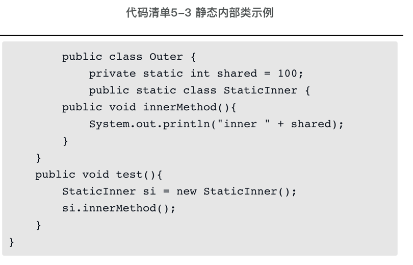
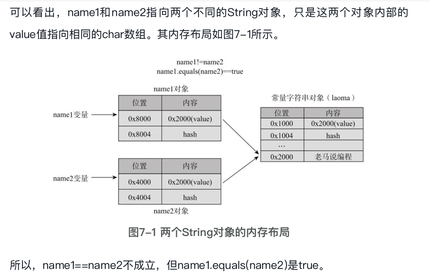
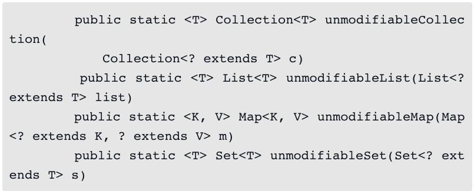
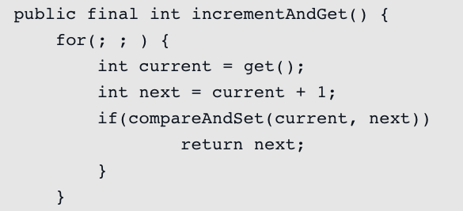

### 编程基础
#### 数据类型和变量
对Java语言而言，有如下基本数据类型。
- 整数类型：有4种整型byte/short/int/long，分别有不同的取值范围；
- 小数类型：有两种类型float/double，有不同的取值范围和精度；
- 字符类型：char，表示单个字符；
- 真假类型：boolean，表示真假

变量就是给数据起名字，方便找不同的数据，它的值可以变，但含义不应变。通过声明变量，每个变量赋予一个数据类型和一个有意义的名字，我们就告诉了计算机要操作的数据。

#### 数组类型
数组长度虽然可以动态确定，但定了之后就不可以变。数组有一个length属性，但只能读，不能改。还有一个小细节，不能在给定初始值的同时给定长度.
如：int [ ] arr = new int[3]{1,2,3}是不允许的。

数组类型和基本类型是有明显不同的，一个基本类型变量，内存中只会有一块对应的内存空间。但数组有两块：一块用于存储数组内容本身，另一块用于存储内容的位置。
用一个例子来说明，有一个int变量a，以及一个int数组变量arr，其代码、变量对应的内存地址和内存内容如下所示：

基本类型a的内存地址是1000，这个位置存储的就是它的值100。数组类型arr的内存地址是2000，这个位置存储的值是一个位置3000,3000开始的位置存储的才是实际的数据“1, 2, 3”。

##### 为什么数组要用两块空间？
假设arrA初始的长度是3, arrB的长度是4，后来将arrB的值赋给了arrA。如果arrA对应的内存空间是直接存储的数组内容，那么它将没有足够的空间去容纳arrB的所有元素。用两块空间存储就简单得多，arrA存储的值就变成了和arrB的一样，存储的都是数组内容{4,5,6,7}的地址，此后访问arrA就和arrB是一样的了，而arrA {1,2,3}的内存空间由于不再被引用会进行垃圾回收，


给数组变量赋值和给数组中元素赋值是两回事，给数组中元素赋值是改变数组内容，而给数组变量赋值则会让变量指向一个不同的位置。上面我们说数组的长度是不可以变的，不可变指的是数组的内容空间，一经分配，长度就不能再变了，但可以改变数组变量的值，让它指向一个长度不同的空间，就像上例中arrA后来指向了arrB一样。给变量赋值就是将变量对应的内存空间设置为一个明确的值，有了值之后，变量可以被加载到CPU并使用。

#### 条件执行
- if的陷阱：初学者有时会忘记在if后面的代码块中加花括号，有时希望执行多条语句而没有花括号，结果只会执行第一条语句，建议所有if后面都加花括号。
- if/else if/else陷阱：需要注意的是，在if/else if/else中，判断的顺序是很重要的，后面的判断只有在前面的条件为false的时候才会执行。
- switch也比较简单，根据表达式的值执行不同的分支，具体来说，根据表达式的值找匹配的case，找到后执行后面的代码，碰到break时结束，如果没有找到匹配的值则执行default后的语句。表达式值的数据类型只能是byte、short、int、char、枚举和String（Java 7以后）。break是指跳出switch语句，执行switch后面的语句。每条case语句后面都应该跟break语句，否则会继续执行后面case中的代码直到碰到break语句或switch结束。

条件执行总体上是比较简单的：单一条件满足时，执行某操作使用if；根据一个条件是否满足执行不同分支使用if/else；表达复杂的条件使用if/else if/else；条件赋值使用三元运算符，根据某一个表达式的值不同执行不同的分支使用switch。

条件执行的语法是比较自然和容易理解的，需要注意的是其中的一些语法细节和陷阱。它执行的本质依赖于**条件跳转、无条件跳转和跳转表**.

#### 循环
在Java中，循环有4种形式，分别是while、do/while、for和foreach：
- while和if的语法很像，只是把if换成了while，它表达的含义也非常简单，只要条件语句为真，就一直执行后面的代码，为假就停止不做了。
- 如果不管条件语句是什么，代码块都会至少执行一次，则可以使用do/while循环。先执行代码块，然后再判断条件语句，如果成立，则继续循环，否则退出循环。
- for后面的括号中有两个分号；，分隔了三条语句。除了第二句循环条件必须返回一个boolean类型外，其他语句没有什么要求，但通常情况下第一条语句用于初始化，尤其是循环的索引变量，第三条语句修改循环变量，一般是步进，即递增或递减索引变量，循环体是在循环中执行的语句。for循环执行的流程如下：1）执行初始化指令；2）检查循环条件是否为true，如果为false，则跳转到第6步；3）循环条件为真，执行循环体；4）执行步进操作；5）步进操作执行完后，跳转到第2步，即继续检查循环条件；6）for循环后面的语句。
- 在for中，每条语句都是可以为空的，也就是说：for(;;)是有效的，这是个死循环，一直在空转，和while(true){}的效果是一样的。可以省略某些语句，但分号；不能省
- foreach不是一个关键字，它使用冒号：，冒号前面是循环中的每个元素，包括数据类型和变量名称，冒号后面是要遍历的数组或集合，每次循环冒号前的元素都会自动更新。对于不需要使用索引变量，只是简单遍历的情况，foreach语法上更为简洁。
- 和if一样，循环内部也是靠条件转移和无条件转移指令实现的。在if中，跳转只会往后面跳，而for会往前面跳，第6行就是无条件跳转指令，跳转到了前面的第3行。break/continue语句也都会转换为跳转指令。
#### 函数
函数的主要组成部分有以下几种。
- 1）函数名字：名字是不可或缺的，表示函数的功能。
- 2）参数：参数有0个到多个，每个参数由参数的数据类型和参数名字组成。
- 3）操作：函数的具体操作代码。
- 4）返回值：函数可以没有返回值，如果没有返回值则类型写成void，如果有则在函数代码中必须使用return语句返回一个值，这个值的类型需要和声明的返回值类型一致。
- 5）修饰符：Java中函数有很多修饰符，分别表示不同的目的。

Java中运行一个程序的时候，需要指定一个定义了main函数的类，Java会寻找main函数，并从main函数开始执行。不管main函数定义在哪里，Java函数都会先找到它，然后从它的第一行开始执行

调用函数如果没有参数要传递，也要加括号()，如print3Lines()。
传递的参数不一定是个变量，可以是常量，也可以是某个运算表达式，可以是某个函数的返回结果。

可变长度参数的语法是在数据类型后面加三个点“... ”，在函数内，可变长度参数可以看作是数组。可变长度参数必须是参数列表中的最后一个，一个函数也只能有一个可变长度的参数。

函数返回值类型为void也可以使用return，即“return; ”，不用带值，含义是返回调用方，只是没有返回值而已。函数的返回值最多只能有一个，那如果实际情况需要多个返回值呢？比如，计算一个整数数组中的最大的前三个数，需要返回三个结果。这个可以用数组作为返回值，在函数内创建一个包含三个元素的数组，然后将前三个结果赋给对应的数组元素。如果实际情况需要的返回值是一种复合结果呢？比如，查找一个字符数组中所有重复出现的字符以及重复出现的次数。这个可以用对象作为返回值。

##### 函数调用的基本原理
函数调用主要是通过栈来存储相关的数据，系统就函数调用者和函数如何使用栈做了约定，返回值可以简单认为是通过一个专门的返回值存储器存储的。具体书1.7节。

### 类的基础
#### 类的基本概念
##### 函数容器
static表示类方法，也叫静态方法，与类方法相对的是实例方法。实例方法没有static修饰符，必须通过实例或者对象调用，而类方法可以直接通过类名进行调用，不需要创建实例。public表示这些函数是公开的，可以在任何地方被外部调用。与public相对的是private。如果是private，则表示私有，这个函数只能在同一个类内被别的函数调用，而不能被外部的类调用。

这里将类看作函数的容器，更多的是从语言实现的角度看，从概念的角度看，Math和Arrays也可以看作自定义数据类型，分别表示数学和数组类型，其中的public static函数可以看作类型能进行的操作。

##### 自定义数据类型
可以**将类看作自定义数据类型**，所谓自定义数据类型就是除了8种基本类型以外的其他类型，用于表示和处理基本类型以外的其他数据。

一个数据类型就主要由4部分组成：
- 类型本身具有的属性，通过类变量体现。表示类变量的时候，static修饰符是必需的，但public和final都不是必需的。
- 类型本身可以进行的操作，通过类方法体现。
- 类型实例具有的属性，通过实例变量体现。
- 类型实例可以进行的操作，通过实例方法体现。所谓实例，字面意思就是一个实际的例子。实例变量表示具体的实例所具有的属性，实例方法表示具体的实例可以进行的操作。

**在实例方法中，有一个隐含的参数，这个参数就是当前操作的实例自己(this)**，直接操作实例变量，实际也需要通过参数进行。实例方法和类方法的更多区别如下所示:
- 类方法只能访问类变量，不能访问实例变量，可以调用其他的类方法，不能调用实例方法。
- 实例方法既能访问实例变量，也能访问类变量，既可以调用实例方法，也可以调用类方法。
```
Point p = new Point();
```
上面这个语句包含了Point类型的变量声明和赋值，可以看成Point p和p = new Point()两部分：
- Point p声明了一个变量，这个变量叫p,是Point类型的，这个变量和数组变量是类似的：都有两块内存，一块存放实际内容，一块存放实际内容的地址。**声明变量本身只会分配存放位置的内存空间，这块空间还没有指向任何实际内容**。因为这种变量和数组变量本身不存储数据，而只是存储实际内容的位置，它们也都称为**引用类型**的变量。 
- p = new Point()创建了一个实例或对象，然后赋值给了Point类型的变量p，它至少做了两件事：1）分配内存，以存储新对象的数据，对象数据包括这个对象的属性。2）给实例变量设置默认值，int类型默认值为0。与方法内定义的局部变量不同，在创建对象的时候，所有的实例变量都会分配一个默认值，这与创建数组的时候是类似的，数值类型变量的默认值是0, boolean是false, char是“\u0000”，引用类型变量都是null。null是一个特殊的值，表示不指向任何对象。这些默认值可以修改。
- 对实例变量和实例方法的访问都通过对象进行，通过对象来访问和操作其内部的数据是一种基本的面向对象思维。一般而言，不应该将实例变量声明为public，而只应该通过对象的方法对实例变量进行操作。这也是为了减少误操作，直接访问变量没有办法进行参数检查和控制，而通过方法修改，可以在方法中进行检查。
##### 变量默认值
- 实例变量都有一个默认值，如果希望修改这个默认值，可以在定义变量的同时就赋值，或者将代码放入初始化代码块中，代码块用{}包围。比如：
```
    int x = 1;
    int y;
    {
        y = 2;        
    }
```

x的默认值设为了1, y的默认值设为了2。在新建一个对象的时候，会先调用这个初始化，然后才会执行构造方法中的代码
- 静态变量可以如下初始化：
```
    static int STATIC_ONE = 1;
    static int STATIC_TWO;
    static{
        STATIC_TWO = 2;
    }
```
STATIC_TWO=2；语句外面包了一个static {}，这叫静态初始化代码块。**静态初始化代码块在类加载的时候执行，这是在任何对象创建之前，且只执行一次**。

##### 构造方法
有一个更简单的方式对实例变量赋初值，就是构造方法：
```
    public Point(){
        this(0,0);
    }
    
    public Point(int x, int y){
        this.x = x;
        this.y = y;
    }
```
这两个就是构造方法，构造方法可以有多个。不同于一般方法，构造方法有一些特殊的地方：
- 1）名称是固定的，与类名相同
- 2）没有返回值，也不能有返回值。构造方法隐含的返回值就是实例本身。
- 3）与普通方法一样，构造方法也可以重载。第一个构造方法，this(0,0)的意思是调用第二个构造方法，并传递参数“0,0”，我们前面解释说this表示当前实例，可以通过this访问实例变量，这是**this的第二个用法，用于在构造方法中调用其他构造方法。这个this调用必须放在第一行**，这个规定也是为了避免误操作。构造方法是用于初始化对象的，如果要调用别的构造方法，先调别的，然后根据情况自己再做调整，而如果自己先初始化了一部分，再调别的，自己的修改可能就被覆盖了。

关于构造方法，下面讨论两个细节概念：一个是默认构造方法；另一个是私有构造方法。
- 每个类都至少要有一个构造方法，在通过new创建对象的过程中会被调用。但构造方法如果没什么操作要做，可以省略。Java编译器会自动生成一个默认构造方法，也没有具体操作。但**一旦定义了构造方法，Java就不会再自动生成默认的**。
- 构造方法可以是私有方法，即修饰符可以为private，为什么需要私有构造方法呢？大致可能有这么几种场景：1）不能创建类的实例，类只能被静态访问，如Math和Arrays类，它们的构造方法就是私有的。2）能创建类的实例，但只能被类的静态方法调用。有一种常见的场景：类的对象有但是只能有一个，即单例（单个实例）。在这种场景中，对象是通过静态方法获取的，而静态方法调用私有构造方法创建一个对象，如果对象已经创建过了，就重用这个对象。3）只是用来被其他多个构造方法调用，用于减少重复代码。

##### 类和对象的声明周期
当第一次通过new创建一个类的对象时，或者直接通过类名访问类变量和类方法时，Java会将类加载进内存，为这个类分配一块空间，这个空间会包括类的定义、它的变量和方法信息，同时还有类的静态变量，并对静态变量赋初始值。

类加载进内存后，一般不会释放，直到程序结束。一般情况下，类只会加载一次，所以静态变量在内存中只有一份。当通过new创建一个对象的时候，对象产生，在内存中，会存储这个对象的实例变量值，每做new操作一次，就会产生一个对象，就会有一份独立的实例变量。每个对象除了保存实例变量的值外，可以理解为还保存着对应类型即类的地址，这样，通过对象能知道它的类，访问到类的变量和方法代码。

对象的释放是被Java用垃圾回收机制管理的，大部分情况下，我们不用太操心，当对象不再被使用的时候会被自动释放。具体来说，对象和数组一样，有两块内存，保存地址的部分分配在栈中，而保存实际内容的部分分配在堆中。栈中的内存是自动管理的，函数调用入栈就会分配，而出栈就会释放。 堆中的内存是被垃圾回收机制管理的，当没有活跃变量指向对象的时候，对应的堆空间就可能被释放，具体释放时间是Java虚拟机自己决定的。活跃变量就是已加载的类的类变量，以及栈中所有的变量。

##### 本节提到的关键字汇总
- 1）public：可以修饰类、类方法、类变量、实例变量、实例方法、构造方法，表示可被外部访问。
- 2）private：可以修饰类、类方法、类变量、实例变量、实例方法、构造方法，表示不可以被外部访问，只能在类内部被使用。
- 3）static：修饰类变量和类方法，它也可以修饰内部类 。
- 4）this：表示当前实例，可以用于调用其他构造方法，访问实例变量，访问实例方法。
- 5）final：修饰类变量、实例变量，表示只能被赋值一次，也可以修饰实例方法和局部变量

#### 类的组合
看书，3.2jie，尤其是那几个类的例子。

将现实概念映射为类以及类组合的这个过程大概就是，想想现实问题有哪些概念，这些概念有哪些属性、哪些行为，概念之间有什么关系，然后定义类、定义属性、定义方法、定义类之间的关系。概念的属性和行为可能是非常多的，但定义的类只需要包括那些与现实问题相关的就行了。

类之间的组合关系在Java中实现的都是引用，但在逻辑关系上，有两种明显不同的关系，一种是包含，另一种是单纯引用。比如，在订单类Order中，Order与User的关系就是单纯引用，User是独立存在的；而Order与OrderItem的关系就是包含，OrderItem总是从属于某一个Order。

#### 代码的组织机制
##### 包的概念
使用任何语言进行编程都有一个相同的问题，就是命名冲突。程序一般不全是一个人写的，会调用系统提供的代码、第三方库中的代码、项目中其他人写的代码等，不同的人就不同的目的可能定义同样的类名/接口名，Java中解决这个问题的主要方法就是包。

包是一个比较容易理解的概念，类似于计算机中的文件夹，正如我们在计算机中管理文件，文件放在文件夹中一样，类和接口放在包中，为便于组织，文件夹一般是一个层次结构，包也类似。包有包名，这个名称以点号（.）分隔表示层次结构。比如，常用的String类就位于包java.lang下，其中java是上层包名，lang是下层包名。**带完整包名的类名称为其完全限定名**。

包的声明、使用和包范围可见性：
- 定义类的时候，应该先使用关键字package声明其包名，包声明语句应该位于源代码的最前面，前面不能有注释外的其他语句。
- 为避免命名冲突，Java中命名包名的一个惯例是使用域名作为前缀，因为域名是唯一的，一般按照域名的反序来定义包名，比如，域名是apache.org，包名就以org.apache开头。没有域名的也没关系，使用一个其他代码不太会用的包名即可，比如shuo. laoma。如果代码需要公开给其他人用，最好有一个域名以确保唯一性，如果只是内部使用，则确保内部没有其他代码使用该包名即可。
- 同一个包下的类之间互相引用是不需要包名的，可以直接使用。但如果类不在同一个包内，则必须要知道其所在的包。使用有两种方式：一种是通过类的完全限定名；另外一种是将用到的类引入当前类，引入的关键字是import,import需要放在package定义之后。只有一个例外，java.lang包下的类可以直接使用，不需要引入，也不需要使用完全限定名，比如String类、System类，其他包内的类则不行。
- 有一种特殊类型的导入，称为静态导入，它有一个static关键字，可以直接导入类的公开静态方法和成员，比如
```
    import java.util.Arrays;
    import static java.util.Array.*; //导入Arrays中的所有静态方法
    import static java.lang.System.out; //导入静态变量out    
```
静态导入不应过度使用，否则难以区分访问的是哪个类的代码。

- 同一个包指的是同一个直接包，子包下的类并不能访问。比如，类shuo.laoma.Hello和shuo.laoma.inner.Test，其所在的包shuo.laoma和shuo.laoma.inner是两个完全独立的包，并没有逻辑上的联系，Hello类和Test类不能互相访问对方的包可见性方法和属性。

- 可以不写修饰符。如果什么修饰符都不写，它的可见性范围就是同一个包内，同一个包内的其他类可以访问，而其他包内的类则不可以访问。
- 除了public和private修饰符，还有一个与继承有关的修饰符protected。protected可见性包括包可见性，也就是说，声明为protected不仅表明子类可以访问，还表明同一个包内的其他类可以访问，即使这些类不是子类也可以。
- 总结来说，可见性范围从小到大是：private < 默认(包) < protected < public。

### 类的继承
计算机程序经常使用类之间的继承关系来表示对象之间的分类关系。在继承关系中，有父类和子类，比如动物类Animal和狗类Dog, Animal是父类，Dog是子类。父类也叫基类，子类也叫派生类。父类、子类是相对的，一个类B可能是类A的子类，但又是类C的父类。之所以叫继承，是因为子类继承了父类的属性和行为，父类有的属性和行为子类都有。但子类可以增加子类特有的属性和行为，某些父类有的行为，子类的实现方式可能与父类也不完全一样。使用继承一方面可以复用代码，公共的属性和行为可以放到父类中，而子类只需要关注子类特有的就可以了；另一方面，不同子类的对象可以更为方便地被统一处理。
#### 基本概念
- 在Java中，即使没有声明父类，也有一个隐含的父类，这个父类叫Object。Object没有定义属性，但定义了一些方法
- 所谓重写，就是定义和父类一样的方法，并重新实现。@Override表示重写
- 1）Java使用extends关键字表示继承关系，一个类最多只能有一个父类；2）子类不能直接访问父类的私有属性和方法。3）除了私有的外，子类继承了父类的其他属性和方法。
- new的过程中，父类的构造方法也会执行，且会优先于子类执行。
- super用于指代父类，可用于调用父类构造方法，访问父类方法和变量：1）super(color)表示调用父类的带color参数的构造方法。调用父类构造方法时，super必须放在第一行。2）super.getColor()表示调用父类的getColor方法，当然不写super.也是可以的，因为这个方法子类没有同名的，没有歧义，当有歧义的时候，通过super．可以明确表示调用父类的方法。3）super同样可以引用父类非私有的变量。
- 子类对象赋值给父类引用变量，这叫向上转型，转型就是转换类型，向上转型就是转换为父类类型。
- Shape shape定义的变量可以引用任何Shape子类类型的对象，这叫多态，即一种类型的变量，可引用多种实际类型对象。这样，对于变量shape，它就有两个类型：类型Shape，我们称之为shape的静态类型；类型Circle/Line/ArrowLine，我们称之为shape的动态类型。一个Shape类型的数组，shapes[i].draw()调用的是其对应动态类型的draw方法，这称之为方法的**动态绑定**。
- 为什么要有多态和动态绑定呢？创建对象的代码和操作对象的代码，经常不在一起，操作对象的代码往往只知道对象是某种父类型，也往往只需要知道它是某种父类型就可以了。可以说，多态和动态绑定是计算机程序的一种重要思维方式，使得操作对象的程序不需要关注对象的实际类型，从而可以统一处理不同对象，但又能实现每个对象的特有行为。
##### 小结
- 1）每个类有且只有一个父类，没有声明父类的，其父类为Object，子类继承了父类非private的属性和方法，可以增加自己的属性和方法，以及重写父类的方法实现。
- 2）new过程中，父类先进行初始化，可通过super调用父类相应的构造方法，没有使用super的情况下，调用父类的默认构造方法。
- 3）子类变量和方法与父类重名的情况下，可通过super强制访问父类的变量和方法。
- 4）子类对象可以赋值给父类引用变量，这叫多态；实际执行调用的是子类实现，这叫动态绑定。
#### 继承的细节
##### 构造方法
子类可以通过super调用父类的构造方法，如果子类没有通过super调用，则会自动调动父类的默认构造方法，那如果父类没有默认构造方法，它的任何子类都必须在构造方法中通过super调用带参数构造方法，否则，Java会提示编译错误。

如果在父类构造方法中调用了可被重写的方法，则可能会出现意想不到的结果：


第一次输出为0，第二次输出为123。第一行为什么是0呢？第一次输出是在new过程中输出的，在new过程中，首先是初始化父类，父类构造方法调用test()方法，test()方法被子类重写了，就会调用子类的test()方法，子类方法访问子类实例变量a，而这个时候子类的实例变量的赋值语句和构造方法还没有执行，所以输出的是其默认值0。像这样，**在父类构造方法中调用可被子类重写的方法，是一种不好的实践，容易引起混淆，应该只调用private的方法**。
##### 重名与静态绑定
子类可以重写父类非private的方法，当调用的时候，会动态绑定，执行子类的方法。实例变量、静态方法和静态变量重名也是可以的，重名后实际上有两个变量或方法。private变量和方法只能在类内访问，访问的也永远是当前类的，即：在子类中访问的是子类的；在父类中访问的是父类的，它们只是碰巧名字一样而已，没有任何关系。public变量和方法，则要看如何访问它。在类内，访问的是当前类的，但子类可以通过super．明确指定访问父类的。在类外，则要看访问变量的静态类型：静态类型是父类，则访问父类的变量和方法；静态类型是子类，则访问的是子类的变量和方法。


**当通过b（静态类型Base）访问时，访问的是Base的变量和方法，当通过c（静态类型Child）访问时，访问的是Child的变量和方法，这称之为静态绑定，即访问绑定到变量的静态类型。静态绑定在程序编译阶段即可决定，而动态绑定则要等到程序运行时。实例变量、静态变量、静态方法、private方法，都是静态绑定的。**

#### 重载和重写
重载是指方法名称相同但参数签名不同（参数个数、类型或顺序不同），重写是指子类重写与父类相同参数签名的方法。
**当有多个重名函数的时候，在决定要调用哪个函数的过程中，首先是按照参数类型进行匹配的，换句话说，寻找在所有重载版本中最匹配的，然后才看变量的动态类型，进行动态绑定。**
##### 父子类型转换
一个父类的变量能不能转换为一个子类的变量，取决于这个父类变量的动态类型（即引用的对象类型）是不是这个子类或这个子类的子类。给定一个父类的变量能不能知道它到底是不是某个子类的对象，从而安全地进行类型转换呢？答案是可以，通过instanceof关键字
##### 继承访问权限protected
变量和函数有public/private修饰符，public表示外部可以访问，private表示只能内部使用，还有一种可见性介于中间的修饰符protected，表示虽然不能被外部任意访问，但可被子类访问。另外，protected还表示可被同一个包中的其他类访问，不管其他类是不是该类的子类。

基类定义了表示对外行为的方法action，并定义了可以被子类重写的两个步骤step1()和step2()，以及被子类查看的变量currentStep，子类通过重写protected方法step1()和step2()来修改对外的行为。这种思路和设计是一种设计模式，称之为模板方法。action方法就是一个模板方法，它定义了实现的模板，而具体实现则由子类提供。模板方法在很多框架中有广泛的应用，这是使用protected的一种常见场景。
##### 可见性重写
重写方法时，一般并不会修改方法的可见性。但重写时，子类方法不能降低父类方法的可见性。不能降低是指，父类如果是public，则子类也必须是public，父类如果是protected，子类可以是protected，也可以是public，即子类可以升级父类方法的可见性但不能降低。

为什么要这样规定呢？继承反映的是“is-a”的关系，即子类对象也属于父类，子类必须支持父类所有对外的行为，将可见性降低就会减少子类对外的行为，从而破坏“is-a”的关系，但子类可以增加父类的行为，所以提升可见性是没有问题的。

##### 防止继承final
有的时候甚至不希望类被继承，可以通过final关键字实现。final关键字可以修饰变量，而这是final的另一种用法。一个Java类，默认情况下都是可以被继承的，但加了final关键字之后就不能被继承了。
一个非final的类，其中的public/protected实例方法默认情况下都是可以被重写的，但加了final关键字后就不能被重写了。
#### 继承实现的基本原理
仔细看书4.3，代码已同步到src/com.logicalJava.extend
#### 类加载过程
在Java中，所谓类的加载是指将类的相关信息加载到内存。在Java中，类是动态加载的，当第一次使用这个类的时候才会加载，加载一个类时，会查看其父类是否已加载，如果没有，则会加载其父类。一个类的信息主要包括以下部分：
- 类变量（静态变量）；
- 类初始化代码；包括：定义静态变量时的赋值语句；静态初始化代码块。
- 类方法（静态方法）；
- 实例变量；
- 实例初始化代码；包括：定义实例变量时的赋值语句；实例初始化代码块；构造方法。
- 实例方法；
- 父类信息引用。 

类加载过程包括：
- 分配内存保存类的信息；
- 给类变量赋默认值；
- 加载父类； 
- 设置父子关系；
- 执行类初始化代码。类初始化代码，是先执行父类的，再执行子类的。不过，父类执行时，子类静态变量的值也是有的，是默认值。

存放类的信息，这个区在Java中称为方法区。加载后，Java方法区就有了一份这个类的信息。
##### 对象创建过程
在类加载之后，new Child()就是创建Child对象，创建对象过程包括：
- 1）分配内存；
- 2）对所有实例变量赋默认值；
- 3）执行实例初始化代码。
  
分配的内存包括本类和所有父类的实例变量，但不包括任何静态变量。实例初始化代码的执行从父类开始，再执行子类的。但在任何类执行初始化代码之前，所有实例变量都已设置完默认值。每个对象除了保存类的实例变量之外，还保存着实际类信息的引用。Child c = new Child()；会将新创建的Child对象引用赋给变量c，而Base b = c；会让b也引用这个Child对象。创建和赋值后，内存布局如图：

##### 方法调用的过程
寻找要执行的实例方法的时候，是从对象的实际类型信息开始查找的，找不到的时候，再查找父类类型信息。而动态绑定实现的机制就是根据对象的实际类型查找要执行的方法，子类型中找不到的时候再查找父类。如果继承的层次比较深，要调用的方法位于比较上层的父类，则调用的效率是比较低的，因为每次调用都要进行很多次查找。**大多数系统使用一种称为虚方法表的方法来优化调用的效率**。所谓虚方法表，就是在类加载的时候为每个类创建一个表，记录该类的对象所有动态绑定的方法（包括父类的方法）及其地址，但一个方法只有一条记录，子类重写了父类方法后只会保留子类的。对于本例来说，Child和Base的虚方法表如图所示：

对Child类型来说，action方法指向Base中的代码，toString方法指向Object中的代码，而step()指向本类中的代码。当通过对象动态绑定方法的时候，只需要查找这个表就可以了，而不需要挨个查找每个父类。
##### 变量的访问过程
对变量的访问是静态绑定的，无论是类变量还是实例变量。代码中演示的是类变量：通过对象访问类变量，系统会转换为通过类直接访问类变量。例子中的实例变量都是private的，不能直接访问；如果是public的，则b.a访问的是对象中Base类定义的实例变量a，而c.a访问的是对象中Child类定义的实例变量a。
#### 继承是双刃剑
##### 继承破坏封装
封装是程序设计的第一原则，没有封装，代码之间会到处存在着实现细节的依赖，构建和维护复杂的程序是难以想象的。继承可能破坏封装是因为子类和父类之间可能存在着实现细节的依赖。子类在继承父类的时候，往往不得不关注父类的实现细节，而父类在修改其内部实现的时候，如果不考虑子类，也往往会影响到子类。

看书4.4.2 封装是如何被破坏的例子。

子类和父类之间是细节依赖，子类扩展父类，仅仅知道父类能做什么是不够的，还需要知道父类是怎么做的，而父类的实现细节也不能随意修改，否则可能影响子类。更具体地说，子类需要知道父类的可重写方法之间的依赖关系，具体到上例中，就是add和addAll方法之间的关系，而且这个依赖关系，父类不能随意改变。
而且父类不能随意增加公开方法，因为给父类增加就是给所有子类增加，而子类可能必须要重写该方法才能确保方法的正确性。
##### 继承没有反映is-a关系
继承关系是设计用来反映is-a关系的。但现实中，设计完全符合is-a关系的继承关系是困难的。比如，绝大部分鸟都会飞，可能就想给鸟类增加一个方法fy()表示飞，但有一些鸟就不会飞，比如企鹅。

继承是应该被当作is-a关系使用的，但是，Java并没有办法约束，父类有的属性和行为，子类并不一定都适用，子类还可以重写方法，实现与父类预期完全不一样的行为。但对于通过父类引用操作子类对象的程序而言，它是把对象当作父类对象来看待的，期望对象符合父类中声明的属性和行为。

##### 如何应对继承的双面性
1、避免继承，有三种方法：
- 使用final关键字：给类或方法方法添加final修饰符
- 优先使用组合而非继承：使用组合可以抵挡父类变化对子类的影响，从而保护子类。
- 使用接口：见下一章

2、正确使用继承
使用继承大概主要有三种场景：1）基类是别人写的，我们写子类；2）我们写基类，别人可能写子类；3）基类、子类都是我们写的。
- 第1种场景中，基类主要是Java API、其他框架或类库中的类，在这种情况下，我们主要通过扩展基类，实现自定义行为，这种情况下需要注意的是：重写方法不要改变预期的行为；阅读文档说明，理解可重写方法的实现机制，尤其是方法之间的依赖关系；在基类修改的情况下，阅读其修改说明，相应修改子类。
- 第2种场景中，需要注意的是：使用继承反映真正的is-a关系，只将真正公共的部分放到基类；对不希望被重写的公开方法添加final修饰符；写文档，说明可重写方法的实现机制，为子类提供指导，告诉子类应该如何重写；在基类修改可能影响子类时，写修改说明。
- 第3种场景，我们既写基类也写子类，关于基类，注意事项和第2种场景类似，关于子类，注意事项和第1种场景类似。

### 类的扩展
#### 接口的本质
很多时候，我们实际上关心的，并不是对象的类型，而是对象的能力，只要能提供这个能力，类型并不重要。比如要将冷水加热，只要能得到热水即可，至于是用电磁炉加热，用燃气灶加热，还是用电热水壶加热，并不重要，即重要的是对象是否有加热水的能力，而并不关心对象到底是什么类型。在这些情况中，类型并不重要，重要的是能力。那如何表示能力呢？接口
##### 接口的概念
接口声明了一组能力，但它自己并没有实现这个能力，它只是一个约定。接口涉及交互两方对象，一方需要实现这个接口，另一方使用这个接口，但双方对象并不直接互相依赖，它们只是通过接口间接交互。
##### 定义接口
比较能力的接口，如下：
```
    public interface MyComparable(){
        int compareTo(Object other);
    }
```
1）Java使用interface这个关键字来声明接口，修饰符一般都是public。2）interface后面就是接口的名字MyComparable。3）接口定义里面，声明了一个方法compareTo，但没有定义方法体，**Java 8之前，接口内不能实现方法**。接口方法不需要加修饰符，加与不加相当于都是public abstract。

##### 实现接口
类可以实现接口，表示类的对象具有接口所表示的能力。
- Java使用implements这个关键字表示实现接口，前面是类名，后面是接口名。
- 实现接口必须要实现接口中声明的方法，比如实现了MyComparable接口的类必须实现compareTo方法。
- 一个类可以实现多个接口，表明类的对象具备多种能力，各个接口之间以逗号分隔。
##### 使用接口
与类不同，接口不能new，不能直接创建一个接口对象，对象只能通过类来创建。但可以声明接口类型的变量，引用实现了接口的类对象。比如，可以这样：
```
  class Point implements MyComparable{
        @Override
        public int compareTo(Object other){
            ....;
        }
  }
  
  MyComparable p = new Point();
```
如果一个类型实现了多个接口，那么这种类型的对象就可以被赋值给任一接口类型的变量.

在一些程序中，代码并不知道具体的类型，这才是接口发挥威力的地方。看书中5.1.4的使用MyComparable接口的例子

**针对接口而非具体类型进行编程，是计算机程序的一种重要思维方式。接口很多时候反映了对象以及对对象操作的本质。它的优点有很多，首先是代码复用，同一套代码可以处理多种不同类型的对象，只要这些对象都有相同的能力。接口更重要的是降低了耦合，提高了灵活性。用接口的代码依赖的是接口本身，而非实现接口的具体类型，程序可以根据情况替换接口的实现，而不影响接口使用者**
##### 接口的细节
- 变量修饰符是public static final，但这个修饰符是可选的，即使不写，也是public static final。这个变量可以通过“接口名．变量名”的方式使用
- 接口也可以继承，一个接口可以继承其他接口，继承的基本概念与类一样，但与类不同的是，接口可以有多个父接口。
- 类的继承与接口可以共存，换句话说，类可以在继承基类的情况下，同时实现一个或多个接口，关键字extends要放在implements之前。
- 接口也可以使用instanceof关键字，用来判断一个对象是否实现了某接口。
##### 使用接口代替继承
见书上解释，我还有点没理解
##### Java 8和Java 9对接口的增强
- 在Java 8之前，接口中的方法都是抽象方法，都没有实现体，Java 8允许在接口中定义两类新方法：静态方法和默认方法，它们有实现体。
- 默认方法用关键字default表示。默认方法与抽象方法都是接口的方法，不同在于，默认方法有默认的实现，实现类可以改变它的实现，也可以不改变。引入默认方法主要是函数式数据处理的需求，是为了便于给接口增加功能。
- 在Java 8中，静态方法和默认方法都必须是public的，Java 9去除了这个限制，它们都可以是private的，引入private方法主要是为了方便多个静态或默认方法复用代码。
#### 抽象类
抽象类就是抽象的类。抽象是相对于具体而言的，一般而言，具体类有直接对应的对象，而抽象类没有，它表达的是抽象概念，一般是具体类的比较上层的父类。比如，狗是具体对象，而动物则是抽象概念；樱桃是具体对象，而水果则是抽象概念；正方形是具体对象，而图形则是抽象概念。
##### 抽象方法和抽象类
- 只有子类才知道如何实现的方法，一般被定义为抽象方法。抽象方法和抽象类都使用abstract这个关键字来声明，语法如下所示：
```
    public abstract class Shape{
        public abstract void draw();
    }
```
- 定义了抽象方法的类必须被声明为抽象类，不过，抽象类可以没有抽象方法。抽象类和具体类一样，可以定义具体方法、实例变量等，**它和具体类的核心区别是，抽象类不能创建对象**。
- 一个类在继承抽象类后，必须实现抽象类中定义的所有抽象方法，除非它自己也声明为抽象类
- 与接口类似，抽象类虽然不能使用new，但可以声明抽象类的变量，引用抽象类具体子类的对象
##### 为什么需要抽象类
使用抽象方法而非空方法体，子类就知道它必须要实现该方法，而不可能忽略，若忽略Java编译器会提示错误。使用抽象类，类的使用者创建对象的时候，就知道必须要使用某个具体子类，而不可能误用不完整的父类。
##### 抽象类和接口
抽象类和接口有类似之处：都不能用于创建对象，接口中的方法其实都是抽象方法。如果抽象类中只定义了抽象方法，那抽象类和接口就更像了。但抽象类和接口根本上是不同的，接口中不能定义实例变量，而抽象类可以，一个类可以实现多个接口，但只能继承一个类。**抽象类和接口是配合而非替代关系，它们经常一起使用，接口声明能力，抽象类提供默认实现，实现全部或部分方法，一个接口经常有一个对应的抽象类**
### 内部类
一个类还可以放在另一个类的内部，称之为内部类，相对而言，包含它的类称之为外部类。

内部类与包含它的外部类有比较密切的关系，而与其他类关系不大，定义在类内部，可以实现对外部完全隐藏，可以有更好的封装性，代码实现上也往往更为简洁。

不过，内部类只是Java编译器的概念，对于Java虚拟机而言，它是不知道内部类这回事的，每个内部类最后都会被编译为一个独立的类。内部类可以方便地访问外部类的私有变量，可以声明为private从而实现对外完全隐藏，相关代码写在一起，写法也更为简洁，这些都是内部类的好处

在Java中，根据定义的位置和方式不同，主要有4种内部类：
- 静态内部类
- 成员内部类。
- 方法内部类。
- 匿名内部类。
##### 静态内部类

静态内部类带有static修饰符。语法上，静态内部类除了位置放在其他类内部外，它与一个独立的类差别不大。静态内部类与外部类的联系也不大（与其他内部类相比）。它可以访问外部类的静态变量和方法，但不可以访问实例变量和方法。在类内部，可以直接使用内部静态类，如test()方法所示。public静态内部类可以被外部使用，只是需要通过“外部类．静态内部类”的方式使用
##### 成员内部类

与静态内部类不同，它没有static修饰，除了静态变量和方法，成员内部类还可以直接访问外部类的实例变量和方法。成员内部类还可以通过“外部类．this.xxx”的方式引用外部类的实例变量和方法，如Outer.this. action()，这种写法一般在重名的情况下使用，如果没有重名，那么“外部类．this. ”是多余的。在外部类内，使用成员内部类与静态内部类是一样的，直接使用即可，如test()方法所示。与静态内部类不同，成员内部类对象总是与一个外部类对象相连的，在外部使用时，它不能直接通过new Outer.Inner()的方式创建对象，而是要先将创建一个Outer类对象，创建内部类对象的语法是“外部类对象．new 内部类()”。

与静态内部类不同，成员内部类中不可以定义静态变量和方法（final变量例外，它等同于常量），下面介绍的方法内部类和匿名内部类也都不可以。Java为什么要有这个规定呢？可以这么理解，这些内部类是与外部实例相连的，不应独立使用，而静态变量和方法作为类型的属性和方法，一般是独立使用的，在内部类中意义不大，而如果内部类确实需要静态变量和方法，那么也可以挪到外部类中。

##### 方法内部类
方法内部类只能在定义的方法内被使用。如果方法是实例方法，则除了静态变量和方法，内部类还可以直接访问外部类的实例变量和方法。如果方法是静态方法，则方法内部类只能访问外部类的静态变量和方法。方法内部类还可以直接访问方法的参数和方法中的局部变量，不过，这些变量必须被声明为final。
##### 

匿名内部类没有单独的类定义，它在创建对象的同时定义类。匿名内部类是与new关联的，在创建对象的时候定义类，new后面是父类或者父接口，然后是圆括号()，里面可以是传递给父类构造方法的参数，最后是大括号{}，里面是类的定义。

匿名内部类只能被使用一次，用来创建一个对象。它没有名字，没有构造方法，但可以根据参数列表，调用对应的父类构造方法。它可以定义实例变量和方法，可以有初始化代码块，初始化代码块可以起到构造方法的作用，只是构造方法可以有多个，而初始化代码块只能有一份。因为没有构造方法，它自己无法接受参数，如果必须要参数，则应该使用其他内部类。与方法内部类一样，匿名内部类也可以访问外部类的所有变量和方法，可以访问方法中的final参数和局部变量。

#### 枚举
枚举是一种特殊的数据，它的取值是有限的，是可以枚举出来的，比如一年有四季、一周有七天。虽然使用类也可以处理这种数据，但枚举类型更为简洁、安全和方便。

枚举使用enum这个关键字来定义，值一般是大写的字母，多个值之间以逗号分隔。枚举类型可以定义为一个单独的文件，也可以定义在其他类内部。
```
    public enum Size{
        SMALL,MEDIUM,LARGE
    }
    
    //使用
    Size size = Size.MEDIUM;
```
### 异常
异常是相对于return的一种退出机制，可以由系统触发，也可以由程序通过throw语句触发，异常可以通过try/catch语句进行捕获并处理，如果没有捕获，则会导致程序退出并输出异常栈信息。
#### 异常类

Throwable是所有异常的基类，它有两个子类：Error和Exception。Error表示系统错误或资源耗尽，由Java系统自己使用，应用程序不应抛出和处理，比如图6-1中列出的虚拟机错误（VirtualMacheError）及其子类内存溢出错误（OutOfMemory-Error）和栈溢出错误（StackOverfowError）。Exception表示应用程序错误，它有很多子类，应用程序也可以通过继承Exception或其子类创建自定义异常，图6-1中列出了三个直接子类：IOException（输入输出I/O异常）、RuntimeException（运行时异常）、SQLException（数据库SQL异常）。RuntimeException比较特殊，它的名字有点误导，因为其他异常也是运行时产生的，它表示的**实际含义是未受检异常（unchecked exception）**，相对而言，Exception的其他子类和Exception自身则是受检异常（checked exception）,Error及其子类也是未受检异常。受检（checked）和未受检（unchecked）的区别在于Java如何处理这两种异常。**对于受检异常，Java会强制要求程序员进行处理，否则会有编译错误，而对于未受检异常则没有这个要求**。

##### catch匹配
catch可以有多条，每条对应一种异常类型，异常处理机制将根据抛出的异常类型找第一个匹配的catch块，找到后，执行catch块内的代码，不再执行其他catch块，如果没有找到，会继续到上层方法中查找。需要注意的是，抛出的异常类型是catch中声明异常的子类也算匹配，所以**需要将最具体的子类放在前面**，如果基类Exception放在前面，则其他更具体的catch代码将得不到执行。

如果多种异常处理的代码是类似的，自Java 7开始支持一种新的语法，多个异常之间可以用“|”操作符:
```
    try{
        //可能抛出ExceptionA和ExceptionB    
    }
    catch(ExceptionA | ExceptionB e){
           e.printStackTrace();
    }
    
```
##### 重新抛出异常
在catch块内处理完后，**可以重新通过throw关键字抛出异常**，异常可以是原来的，也可以是新建的。


为什么要重新抛出呢？因为当前代码不能够完全处理该异常，需要调用者进一步处理。为什么要抛出一个新的异常呢？因为当前异常不太合适。不合适可能是信息不够，需要补充一些新信息；还可能是过于细节，不便于调用者理解和使用，如果调用者对细节感兴趣，还可以继续通过getCause()获取到原始异常。

##### finally
atch后面可以跟finally语句，语法如下所示：
```
    try{
        //可能抛出异常
    }
    catch(Exception e){
        //捕获并处理异常
    }
    finally{
        //不管有没有异常都执行
    }
```

finally内的代码不管有无异常发生，都会执行，具体来说：
- 如果没有异常发生，在try内的代码执行结束后执行。
- 如果有异常发生且被catch捕获，在catch内的代码执行结束后执行。 
- 如果有异常发生但没被捕获，则在异常被抛给上层之前执行。

由于**finally的这个特点，它一般用于释放资源，如数据库连接、文件流等**。try/catch/finally语法中，catch不是必需的，也就是可以只有try/finally，表示不捕获异常，异常自动向上传递，但finally中的代码在异常发生后也执行。

finally语句有一个执行细节，如果在try或者catch语句内有return语句，则return语句在finally语句执行结束后才执行，但finally并不能改变返回值：在执行到try内的return语句前，会先将返回值保存在一个临时变量中，然后才执行finally语句，最后try再返回那个临时变量，finally中对这个返回变量的修改不会被返回。

如果在finally中也有return语句呢？try和catch内的return会丢失，实际会返回finally中的返回值。finally中有return不仅会覆盖try和catch内的返回值，还会掩盖try和catch内的异常，就像异常没有发生一样。如果finally中抛出了异常，则原异常也会被掩盖

**一般而言，为避免混淆，应该避免在finally中使用return语句或者抛出异常，如果调用的其他代码可能抛出异常，则应该捕获异常并进行处理。**

##### try-with-resources
对于一些使用资源的场景，比如文件和数据库连接，典型的使用流程是首先打开资源，最后在finally语句中调用资源的关闭方法，针对这种场景，Java 7开始支持一种新的语法，称之为try-with-resources：

资源r的声明和初始化放在try后的圆括号内，不用再调用finally，在语句执行完try语句后，会自动调用资源的close()方法。资源可以定义多个，以分号分隔。在Java 9之前，资源必须声明和初始化在try语句块内，Java 9去除了这个限制，资源可以在try语句外被声明和初始化，但必须是final的或者是事实上final的（即虽然没有声明为final但也没有被重新赋值）。
##### throws
异常机制中，还有一个和throw很像的关键字throws，用于声明一个方法可能抛出的异常：
```
    public void test() throws SQLException,NumberFormatException{
        //主提代码   
    }
```

**throws跟在方法的括号后面，可以声明多个异常，以逗号分隔**。这个声明的含义是，这个方法内可能抛出这些异常，且没有对这些异常进行处理，至少没有处理完，调用者必须进行处理。这个声明没有说明具体什么情况会抛出什么异常，作为一个良好的实践，应该将这些信息用注释的方式进行说明，这样调用者才能更好地处理异常。

对于未受检异常，是不要求使用throws进行声明的，但对于受检异常，则必须进行声明，换句话说，如果没有声明，则不能抛出。**对于受检异常，不可以抛出而不声明，但可以声明抛出但实际不抛出**。这主要用于在父类方法中声明，父类方法内可能没有抛出，但子类重写方法后可能就抛出了，子类不能抛出父类方法中没有声明的受检异常，所以就将所有可能抛出的异常都写到父类上了。

如果一个方法内调用了另一个声明抛出受检异常的方法，则必须处理这些受检异常，处理的方式既可以是catch，也可以是继续使用throws.
##### 对比受检和未受检异常
未受检异常和受检异常的区别如下：受检异常必须出现在throws语句中，调用者必须处理，Java编译器会强制这一点，而未受检异常则没有这个要求。

#### 如何使用异常
##### 异常应该且仅用于异常情况
异常应该且仅用于异常情况，是指异常不能代替正常的条件判断。比如，循环处理数组元素的时候，应该先检查索引是否有效再进行处理，而不是等着抛出索引异常再结束循环。对于一个引用变量，如果正常情况下它的值也可能为null，那就应该先检查是不是null，不为null的情况下再进行调用。另一方面，真正出现异常的时候，应该抛出异常，而不是返回特殊值。
##### 异常处理的目标
异常大概可以分为三种来源：用户、程序员、第三方。用户是指用户的输入有问题；程序员是指编程错误；第三方泛指其他情况，如I/O错误、网络、数据库、第三方服务等。每种异常都应该进行适当的处理。

处理的目标可以分为恢复和报告。恢复是指通过程序自动解决问题。报告的最终对象可能是用户，即程序使用者，也可能是系统运维人员或程序员。报告的目的也是为了恢复，但这个恢复经常需要人的参与。对用户，如果用户输入不对，可以提示用户具体哪里输入不对，如果是编程错误，可以提示用户系统错误、建议联系客服，如果是第三方连接问题，可以提示用户稍后重试。对系统运维人员或程序员，他们一般不关心用户输入错误，而关注编程错误或第三方错误，对于这些错误，需要报告尽量完整的细节，包括异常链、异常栈等，以便尽快定位和解决问题。用户输入或编程错误一般都是难以通过程序自动解决的，第三方错误则可能可以，甚至很多时候，程序都不应该假定第三方是可靠的，应该有容错机制。比如，某个第三方服务连接不上（比如发短信），可能的容错机制是换另一个提供同样功能的第三方试试，还可能是间隔一段时间进行重试，在多次失败之后再报告错误。

##### 异常处理的逻辑
如果自己知道怎么处理异常，就进行处理；如果可以通过程序自动解决，就自动解决；如果异常可以被自己解决，就不需要再向上报告。如果自己不能完全解决，就应该向上报告。如果自己有额外信息可以提供，有助于分析和解决问题，就应该提供，可以以原异常为cause重新抛出一个异常。总有一层代码需要为异常负责，可能是知道如何处理该异常的代码，可能是面对用户的代码，也可能是主程序。如果异常不能自动解决，对于用户，应该根据异常信息提供用户能理解和对用户有帮助的信息；对运维和开发人员，则应该输出详细的异常链和异常栈到日志。这个逻辑**与在公司中处理问题的逻辑是类似的，每个级别都有自己应该解决的问题，自己能处理的自己处理，不能处理的就应该报告上级，把下级告诉他的和他自己知道的一并告诉上级，最终，公司老板必须要为所有问题负责。每个级别既不应该掩盖问题，也不应该逃避责任**。
### 常用基础类
#### 包装类
- 每种包装类都有一个静态方法valueOf()，接受基本类型，返回引用类型，也都有一个实例方法xxxValue()返回对应的基本类型。
- 将基本类型转换为包装类的过程，一般称为“装箱”，而将包装类型转换为基本类型的过程，则称为“拆箱”。Java 5以后引入了自动装箱和拆箱技术，可以直接将基本类型赋值给引用类型
- hashCode和equals方法联系密切，对两个对象，如果equals方法返回true，则hashCode也必须一样。反之不要求，equal方法返回false时，hashCode可以一样，也可以不一样，但应该尽量不一样。hashCode的默认实现一般是将对象的内存地址转换为整数，子类如果重写了equals方法，也必须重写hashCode。
- 除了toString方法外，包装类还有一些其他与String相关的方法。除了Character外，每个包装类都有一个静态的valueOf(String)方法，根据字符串表示返回包装类对象
#### String
- String类内部用一个用final修饰的字符数组表示字符串(Java 9是byte数组)，可以根据char数组构造String，String会根据参数新创建一个数组，并复制内容，而不会直接用参数中的字符数组。String中的大部分方法内部也都是操作的这个字符数组。
- 字符串常量放在一个共享的地方，这个地方称为字符串常量池，它保存所有的常量字符串，每个常量只会保存一份，被所有使用者共享。当通过常量的形式使用一个字符串的时候，使用的就是常量池中的那个对应的String类型的对象。




##### StringBuilder
- 通过new新建StringBuilder对象，通过append方法添加字符串，然后通过toString方法获取构建完成的字符串。
- StringBuilder类也封装了一个字符数组，与String不同，它不是final的，可以修改。
- 对于简单的情况，可以直接使用String的+和+=，对于复杂的情况，尤其是有循环的时候，应该直接使用StringBuilder。
#### Arrays
- Arrays的toString()方法可以方便地输出一个数组的字符串形式。
- Arrays有sort方法可以对基本类型的数据排序，默认升序，sort还可以直接接受对象类型，但对象需要实现Comparable接口。如果希望按照从大到小排序呢？对于对象类型，可以指定一个不同的Comparator，可以用匿名内部类来实现Comparator，如：
```
    String arr = {"hello","world","acb"};
    Array.sort(arr, new Comparator<String>(){
        @Override
        public int compare(String o1, String o2){
            return o2.compareToIgnoreCase(o1);
        }
    });
```

- 二分查找,binarySearch

#### 日期和时间(Java 8之前)
##### Date 
Date是Java API中最早引入的关于日期的类，一开始，Date也承载了关于年历的角色，但由于不能支持国际化，其中的很多方法都已经过时了，被标记为了@Deprecated，不再建议使用。
- Date有两个构造方法：第一个构造方法是根据传入的毫秒数进行初始化；第二个构造方法是默认构造方法，它根据System.currentTimeMillis()的返回值进行初始化。System.currentTimeMillis()是一个常用的方法，它返回当前时刻距离纪元时的毫秒数。

  
##### TimeZone
TimeZone表示时区，它是一个抽象类，有静态方法用于获取其实例。获取当前的默认时区，代码为：
```
    //获取默认时区，并输出其ID
    TimeZone tz = TimeZone.getDefault();
    System.out.println(tz.getID())
```

##### Locale
Locale表示国家（或地区）和语言，它有两个主要参数：一个是国家（或地区）；另一个是语言，每个参数都有一个代码，不过国家（或地区）并不是必需的。比如，中国内地的代码是CN，中国台湾地区的代码是TW，美国的代码是US，中文语言的代码是zh，英文语言的代码是en。与TimeZone类似，Locale也有静态方法获取默认值
##### Calendar
Calendar类是日期和时间操作中的主要类，它表示与TimeZone和Locale相关的日历信息，可以进行各种相关的运算。与Date类似，Calendar内部也有一个表示时刻的毫秒数。与new Date()类似，新创建的Calendar对象表示的也是当前时间，与Date不同的是， Calendar对象可以方便地获取年月日等日历信息。

Calendar是抽象类，不能直接创建对象，它提供了多个静态方法，可以获取Calendar实例，如getInstance()和带TimeZone和Locale参数的getInstance方法。
##### DateFormat
DateFormat类主要在Date和字符串表示之间进行相互转换，它有两个主要的方法： format将Date转换为字符串，parse将字符串转换为Date。
##### SimpleDateFormat
SimpleDateFormat是DateFormat的子类，相比DateFormat，它的一个主要不同是，它可以接受一个自定义的模式（pattern）作为参数，这个模式规定了Date的字符串形式
pattern中的英文字符a～z和A～Z表示特殊含义，其他字符原样输出，这里：
- yyyy：表示4位的年。
- MM：表示月，用两位数表示。
- dd：表示日，用两位数表示。
- HH：表示24小时制的小时数，用两位数表示。
- mm：表示分钟，用两位数表示。
- ss：表示秒，用两位数表示。
- E：表示星期几

  
#### 随机
##### Math.random
Java中，对随机最基本的支持是Math类中的静态方法random()，它生成一个0～1的随机数，类型为double，包括0但不包括1。
##### Random
Random类提供了更为丰富的随机方法，它的方法不是静态方法，使用Random，先要创建一个Random实例。


看书7.6的随机密码、洗牌、带权重的随机选择、微信抢红包和北京购车摇号等代码

### 泛型
#### 基本概念和原理
“泛型”的字面意思就是广泛的类型。类、接口和方法代码可以应用于非常广泛的类型，代码与它们能够操作的数据类型不再绑定在一起，同一套代码可以用于多种数据类型，这样，不仅可以复用代码，降低耦合，而且可以提高代码的可读性和安全性。

泛型类，与普通类的区别体现在： 类名后面多了一个<T>；参数的类型可以为T。T表示类型参数，泛型就是类型参数化，处理的数据类型不是固定的，而是可以作为参数传入。类型参数可以有多个，多个类型之间以逗号分隔.使用时，通过<>指定参数类型，如<String, Integer>，在Java7前，它既出现在了声明变量时，也出现在了new后面，比较烦琐，从Java 7开始，支持省略new后面的类型参数，可以如下使用.
##### 基本原理
对于泛型类，Java编译器会将泛型代码转换为普通的非泛型代码，将**类型参数擦除，替换为Object，插入必要的强制类型转换**。Java虚拟机实际执行的时候，它是不知道泛型这回事的，只知道普通的类及代码。再强调一下，Java泛型是通过擦除实现的，类定义中的类型参数如T会被替换为Object，在程序运行过程中，不知道泛型的实际类型参数。认识到这一点是非常重要的，它有助于我们理解Java泛型的很多限制。

##### 泛型的好处
型主要有两个好处：更好的安全性，更好的可读性。

假如写代码时不小心把类型弄错了，不过，代码编译时是没有任何问题的，但运行时程序抛出了类型转换异常ClassCastException。如果使用泛型，则不可能犯这个错误

开发环境（如Eclipse）会提示类型错误，即使没有好的开发环境，编译时Java编译器也会提示。这称之为类型安全。使用泛型，还可以省去烦琐的强制类型转换，再加上明确的类型信息，代码可读性也会更好。

##### 容器类
泛型类最常见的用途是作为容器类。所谓容器类，简单地说，就是容纳并管理多项数据的类。数组就是用来管理多项数据的，但数组有很多限制，比如，长度固定，插入、删除操作效率比较低。计算机技术有一门课程叫数据结构，专门讨论管理数据的各种方式。这些数据结构在Java中的实现主要就是Java中的各种容器类。

##### 泛型方法
一个方法是不是泛型的，与它所在的类是不是泛型没有什么关系。泛型方法的类型参数为放在返回值前面，与泛型类一样，类型参数可以有多个，以逗号分隔，与泛型类不同，调用方法时一般并不需要特意指定类型参数的实际类型，Java编译器可以自动推断出来。
##### 泛型接口
Comparable和Comparator接口都是泛型的。实现接口时，应该指定具体的类型。
##### 类型参数的限定
Java支持限定参数的一个上界，也就是说，参数必须为给定的上界类型或其子类型，这个限定是通过extends关键字来表示的。这个上界可以是某个具体的类或者某个具体的接口，也可以是其他的类型参数，定边界后，类型擦除时就不会转换为Object了，而是会转换为它的边界类型。
#### 通配符
有点晕了，自己再看几遍书吧

- 1）通配符形式都可以用类型参数的形式来替代，通配符能做的，用类型参数都能做。
- 2）通配符形式可以减少类型参数，形式上往往更为简单，可读性也更好，所以，能用通配符的就用通配符。
- 3）如果类型参数之间有依赖关系，或者返回值依赖类型参数，或者需要写操作，则只能用类型参数。
- 4）通配符形式和类型参数往往配合使用，比如，定义必要的类型参数，使用通配符表达依赖，并接受更广泛的数据类型。
##### 超类型通配符
还有一种通配符，与形式<? extends E>正好相反，它的形式为<? super E>，称为超类型通配符，表示E的某个父类型。

#### 细节和局限性
##### 使用泛型类、方法和接口
- 因为类型参数会被替换为Object，所以Java泛型中不能使用基本数据类型，解决方法是使用基本类型对应的包装类。
- 类型信息也是一个对象，它的类型为Class, Class本身也是一个泛型类，每个类的类型对象可以通过类名.class的方式引用，比如String. class。这个类型对象也可以通过对象的getClass()方法获得，这个类型对象只有一份，与泛型无关，所以Java不支持类似如下写法：
```
    Pair<Integer>.class;
```  
一个泛型对象的getClass方法的返回值与原始类型对象也是相同的，比如，下面代码的输出都是true：
```
    Pair<Integer> p1 = new Pair<Integer>(1, 100);
    Pair<String> p2 = new Pair<String>("hello", "world");
    System.out.println(Pair.class == p1.getClass()); // true
    System.out.println(Pair.class == p2.getClass()); // true
```
- instanceof后面是接口或类名，instanceof是运行时判断，也与泛型无关
##### 定义泛型类、接口和方法
- 不能通过类型参数创建对象，比如，T是类型参数，下面的写法都是非法的：T elm = new T();如果确实希望根据类型创建对象呢,需要设计API接受类型对象，即Class对象，并使用Java中的反射机制。
- 对于泛型类声明的类型参数，可以在实例变量和方法中使用，但在静态变量和静态方法中是不能使用的。不过，对于静态方法，它可以是泛型方法，可以声明自己的类型参数，这个参数与泛型类的类型参数是没有关系的
### 列表和队列
#### ArrayList

#### 基本原理
书，9.1.2
#### 迭代
- ArrayList实现了Iterable接口，Iterable表示可迭代，定义就是要求实现iterator方法。iterator方法的声明为返回一个实现了Iterator接口的对象，Iterator的方法：hasNext()判断是否还有元素未访问，next()返回下一个元素，remove()删除最后返回的元素
- Iterable表示对象可以被迭代，它有一个方法iterator()，返回Iterator对象，实际通过Iterator接口的方法进行遍历；如果对象实现了Iterable，就可以使用foreach语法；类可以不实现Iterable，也可以创建Iterator对象。

```
    ArrayList<Integer> intList = new ArrayList<Integer>();
    //foreach
    for(Integer a : iniList){
        System.out.println(a);
    }
    //迭代器
    Iterator it = intList.iterator();
    while(it.hasNext()){
        System.out.println(it.next());
    }
```
- 除了iterator(), ArrayList还提供了返回Iterator接口的方法：ListIterator扩展了Iterator接口，增加了一些方法，向前遍历、添加元素、修改元素、返回索引位置等.
- 关于迭代器，有一种常见的误用，就是在迭代的中间调用容器的删除方法:

  如何避免这个异常呢？可以使用迭代器的remove方法，如下所示：
  
  
- 迭代器的remove调用了ArrayList的remove方法，但同时更新了cursor、lastRet和expectedModCount的值，所以它可以正确删除。不过，需要注意的是，**调用remove方法前必须先调用next**。
##### ArrayList实现的接口
- Collection，表示一个数据集合，数据间没有位置或顺序的概念
- List表示有顺序或位置的数据集合，它扩展了Collection。
- 没有任何代码的接口在Java中被称为标记接口，用于声明类的一种属性。实现了RandomAccess接口的类表示可以随机访问
##### ArrayList的其他方法
返回数组：
```
    //返回Obect数组
    public Object [] toArray();
    //返回对应类型的数组，如果参数数组长度能容纳所有元素就使用该数组，
    //否则就新建一个数组
    public <T> T toArray(T [] a);
```

返回对应的List：
Arrays中有一个静态方法asList可以返回对应的List。这个方法返回的List是Arrays类的一个内部类，在这个内部类的实现中，内部用的数组就是传入的数组，没有拷贝，也不会动态改变大小，所以对数组的修改也会反映到List中，对List调用add、remove方法会抛出异常。要使用ArrayList完整的方法，应该新建一个ArrayList，如下所示：
```
    List<Integer> list = new ArrayList<Integer>(Arrays.asList(arr));
```

对于ArrayList，它的特点是内部采用动态数组实现，这决定了以下几点。
- 1）可以随机访问，按照索引位置进行访问效率很高，效率是O(1)。
- 2）除非数组已排序，否则按照内容查找元素效率比较低，具体是O(N), N为数组内容长度。
- 3）添加元素的效率还可以，重新分配和复制数组的开销被平摊了，具体来说，添加N个元素的效率为O(N)。
- 4）插入和删除元素的效率比较低，因为需要移动元素，具体为O(N)。

#### LinkedList
LinkedList与ArrayList一样，同样实现了List接口，而List接口扩展了Collection接口，Collection又扩展了Iterable接口，所有这些接口的方法都是可以使用的

LinkedList还实现了队列接口Queue，所谓队列就类似于日常生活中的各种排队，特点就是先进先出，在尾部添加元素，从头部删除元素.Queue扩展了Collection，它的主要操作有三个：在尾部添加元素（add、offer）；查看头部元素（element、peek），返回头部元素，但不改变队列；❑ 删除头部元素（remove、poll），返回头部元素，并且从队列中删除。每种操作都有两种形式，对于特殊情况的处理不同。特殊情况是指队列为空或者队列为满。在队列为空时，element和remove会抛出异常NoSuchElementException，而peek和poll返回特殊值null；在队列为满时，add会抛出异常IllegalStateException，而offer只是返回false。

Java中没有单独的栈接口，栈相关方法包括在了表示双端队列的接口Deque中，主要有三个方法：1）push表示入栈，在头部添加元素，栈的空间可能是有限的，如果栈满了，push会抛出异常IllegalStateException。2）pop表示出栈，返回头部元素，并且从栈中删除，如果栈为空，会抛出异常NoSuch-ElementException。3）peek查看栈头部元素，不修改栈，如果栈为空，返回null。

有一个更为通用的操作两端的接口Deque。Deque扩展了Queue，包括了栈的操作方法。

xxxFirst操作头部，xxxLast操作尾部。与队列类似，每种操作有两种形式，区别也是在队列为空或满时处理不同。为空时，getⅩⅩⅩ/removeⅩⅩⅩ会抛出异常，而peekⅩⅩⅩ/pollⅩⅩⅩ会返回null。队列满时，addⅩⅩⅩ会抛出异常，offerⅩⅩⅩ只是返回false。栈和队列只是双端队列的特殊情况，它们的方法都可以使用双端队列的方法替代，不过，使用不同的名称和方法，概念上更为清晰。

##### 实现原理
书9.2.2

LinkedList内部是一个双向链表，并维护了长度、头节点和尾节点，这决定了它有如下特点。
- 1）按需分配空间，不需要预先分配很多空间。
- 2）不可以随机访问，按照索引位置访问效率比较低，必须从头或尾顺着链接找，效率为O(N/2)。
- 3）不管列表是否已排序，只要是按照内容查找元素，效率都比较低，必须逐个比较，效率为O(N)。
- 4）在两端添加、删除元素的效率很高，为O(1)。
- 5）在中间插入、删除元素，要先定位，效率比较低，为O(N)，但修改本身的效率很高，效率为O(1)。

#### ArrayDeque
ArrayDeque实现了双端队列，内部使用循环数组实现，这决定了它有如下特点。
- 1）在两端添加、删除元素的效率很高，动态扩展需要的内存分配以及数组复制开销可以被平摊，具体来说，添加N个元素的效率为O(N)。
- 2）根据元素内容查找和删除的效率比较低，为O(N)。
- 3）与ArrayList和LinkedList不同，没有索引位置的概念，不能根据索引位置进行操作。
  
ArrayDeque和LinkedList都实现了Deque接口，应该用哪一个呢？如果只需要Deque接口，从两端进行操作，**一般而言，ArrayDeque效率更高一些，应该被优先使用；如果同时需要根据索引位置进行操作，或者经常需要在中间进行插入和删除，则应该选LinkedList。**

### Map和Set
#### HashMap
##### Map接口
Map有键和值的概念。一个键映射到一个值，Map按照键存储和访问值，键不能重复，即一个键只会存储一份，给同一个键重复设值会覆盖原来的值。使用Map可以方便地处理需要根据键访问对象的场景。

Java 7中Map接口的定义如下所示，用注释表示方法的含义：


Set是一个接口，表示的是数学中的集合概念，即没有重复的元素集合。它扩展了Collection，但没有定义任何新的方法，不过，它要求所有实现者都必须确保Set的语义约束，即不能有重复元素。

Map中的键是没有重复的，所以ketSet()返回了一个Set。keySet()、values()、entrySet()有一个共同的特点，它们返回的都是视图，不是复制的值，基于返回值的修改会直接修改Map自身。比如：map.keySet().clear()会清除所有的键值对。
##### HashMap实现原理
看书10.1.3，可以结合以前整理的八股。

HashMap内部有如下几个主要的实例变量：size表示实际键值对的个数，threshold表示阈值，当键值对个数size大于等于threshold时考虑进行扩展，loadFactor是负载因子，表示整体上table被占用的程度，是一个浮点数，默认为0.75，可以通过构造方法进行修改。table是一个Entry类型的数组，称为哈希表或哈希桶，其中的每个元素指向一个单向链表，链表中的每个节点表示一个键值对。Entry是一个内部类，其中，key和value分别表示键和值，next指向下一个Entry节点，hash是key的hash值。

需要说明的是，HashMap不是线程安全的，Java中还有一个类Hashtable，它是Java最早实现的容器类之一，实现了Map接口，实现原理与HashMap类似，但没有特别的优化，它内部通过synchronized实现了线程安全。在HashMap中，键和值都可以为null，而在Hashtable中不可以。在不需要并发安全的场景中，推荐使用HashMap。在高并发的场景中，推荐使用ConcurrentHashMap。根据哈希值存取对象、比较对象是计算机程序中一种重要的思维方式，它使得存取对象主要依赖于自身Hash值，而不是与其他对象进行比较，存取效率也与集合大小无关，高达O(1)，即使进行比较，也利用Hash值提高比较性能。

#### HashSet
##### 用法
Set接口：


与HashMap类似，HashSet要求元素重写hashCode和equals方法，且对于两个对象，如果equals相同，则hashCode也必须相同，如果元素是自定义的类，需要注意这一点，利用IDE开发工具往往可以自动生成这两个方法。

HashSet有很多应用场景，比如：
- 1）去重，如果对去重后的元素没有顺序要求，则HashSet可以方便地用于去重；
- 2）保存特殊值，Set可以用于保存各种特殊值，程序处理用户请求或数据记录时，根据是否为特殊值判断是否进行特殊处理，比如保存IP地址的黑名单或白名单；
- 3）集合运算，使用Set可以方便地进行数学集合中的运算，如交集、并集等运算，这些运算有一些很现实的意义。比如，用户标签计算，每个用户都有一些标签，两个用户的标签交集就表示他们的共同特征，交集大小除以并集大小可以表示他们的相似程度。
##### 实现原理
HashSet内部是用HashMap实现的，它内部有一个HashMap实例变量，HashSet相当于只有键，值都是相同的固定值。
#### 排序二叉树
排序二叉树也是二叉树，但它没有重复元素，而且是有序的二叉树：如果左子树不为空，则左子树上的所有节点都小于该节点；如果右子树不为空，则右子树上的所有节点都大于该节点。

高度平衡的定：即任何节点的左右子树的高度差最多为一。满足这个平衡定义的排序二叉树又被称为AVL树，在插入和删除节点时，通过一次或多次旋转操作来重新平衡树。在TreeMap的实现中，用的并不是AVL树，而是红黑树，与AVL树类似，红黑树也是一种平衡的排序二叉树，也是在插入和删除节点时通过旋转操作来平衡的，但它并不是高度平衡的，而是大致平衡的。所谓大致是指，它确保任意一条从根到叶子节点的路径，没有任何一条路径的长度会比其他路径长过两倍。红黑树减弱了对平衡的要求，但降低了保持平衡需要的开销，在实际应用中，统计性能高于AVL树。它对每个节点进行着色，颜色或黑或红，并对节点的着色有一些约束，满足这个约束即可以确保树是大致平衡的。

#### TreeMap
Map接口有另一个重要的实现类TreeMap，在TreeMap中，键值对之间按键有序，TreeMap的实现基础是排序二叉树。

TreeMap有两个基本构造方法：第一个为默认构造方法，如果使用默认构造方法，要求Map中的键实现Comparabe接口，TreeMap内部进行各种比较时会调用键的Comparable接口中的compareTo方法。第二个接受一个比较器对象comparator，如果comparator不为null，在TreeMap内部进行比较时会调用这个comparator的compare方法，而不再调用键的compareTo方法，也不再要求键实现Comparable接口。第一个更为简单，但要求键实现Comparable接口，且期望的排序和键的比较结果是一致的；第二个更为灵活，不要求键实现Comparable接口，比较器可以用灵活复杂的方式进行实现。

需要强调的是，TreeMap是按键而不是按值有序，无论哪一种，都是对键而非值进行比较。
#### TreeSet
Set接口还有另一个重要的实现类TreeSet，它是有序的，TreeSet是基于TreeMap的。TreeSet的基本构造方法有两个：第一个是默认构造方法，假定元素实现了Comparable接口；第二个使用传入的比较器，不要求元素实现Comparable。TreeSet经常也只是当作Set使用，只是希望迭代输出有序。

因为有序，TreeSet还实现了NavigableSet和SortedSet接口，NavigableSet扩展了SortedSet，可以方便地根据顺序进行查找和操作，如第一个、最后一个、某一取值范围、某一值的邻近元素等
#### LinkedHashMap
##### 基本用法
LinkedHashMap是HashMap的子类，但内部还有一个双向链表维护键值对的顺序，每个键值对既位于哈希表中，也位于这个双向链表中。LinkedHashMap支持两种顺序：一种是插入顺序；另外一种是访问顺序。

插入顺序容易理解，先添加的在前面，后添加的在后面，修改操作不影响顺序。所谓访问是指get/put操作，对一个键执行get/put操作后，其对应的键值对会移到链表末尾，所以，最末尾的是最近访问的，最开始的最久没被访问的，这种顺序就是访问顺序。LinkedHashMap有5个构造方法，其中4个都是按插入顺序，只有一个构造方法可以指定按访问顺序，默认情况下，LinkedHashMap是按插入有序的。

##### 原理
书10.6.2

#### EnumMap
如果需要一个Map的实现类，并且键的类型为枚举类型，可以使用HashMap，但应该使用一个专门的实现类EnumMap。
##### 基本用法
举个简单的例子。比如，有一批关于衣服的记录，我们希望按尺寸统计衣服的数量。代码如下：
``` 
    public enum Size{
        SMALL,MEDIUM,LARGE
    }
    
    class Clothes{
        String id;
        Size size;
    }
    public Static Map<Size, Integer> countBySize(List<Clothes> clothes){
        Map<Size, Integer> map = new EnumMap<>(Size.class);
        for(Clothes c : clothes){
            Size size = c.getSize();
            Integer count = map.get(size);
            if(count != null){
                map.put(size, count + 1);
            }
            else{
                map.put(size, 1);
            }
        }
        return map;
    }
```
与HashMap不同，它需要传递一个类型信息，Size.class表示枚举类Size的运行时类型信息，Size.class也是一个对象，它的类型是Class。没有这个， EnumMap就不知道具体的枚举类是什么，也无法初始化内部的数据结构。与HashMap不同，EnumMap是保证顺序的，输出是按照键在枚举中的顺序的。
##### 实现原理
没看
#### EnumSet
EnumSet不是，它的实现与EnumMap没有任何关系，而是用极为精简和高效的位向量实现的。
##### 基本用法
与TreeSet/HashSet不同，EnumSet是一个抽象类，不能直接通过new新建，不过，EnumSet提供了若干静态工厂方法，可以创建EnumSet类型的对象。

##### 应用场景和原理
没细看
### 堆与优先级队列
#### 堆的概念与算法
- 堆首先是一棵二叉树，但它是完全二叉树
- 在堆中，可以有重复元素，元素间不是完全有序的，但对于父子节点之间，有一定的顺序要求。根据顺序分为两种堆：一种是最大堆，另一种是最小堆。最大堆根是最大的，最小堆根是最小的，堆使用数组进行物理存储。

看书中11.1.2的算法，
#### PriorityQueue
PriorityQueue是优先级队列，它首先实现了队列接口（Queue），与LinkedList类似，它的队列长度也没有限制，与一般队列的区别是，它有优先级的概念，每个元素都有优先级，队头的元素永远都是优先级最高的。PriorityQueue内部是用堆实现的，内部元素不是完全有序的，不过，逐个出队会得到有序的输出。虽然名字叫优先级队列，但也可以将PriorityQueue看作一种比较通用的实现了堆的性质的数据结构，可以用PriorityQueue来解决适合用堆解决的问题
##### 基本用法
PriorityQueue有多个构造方法，默认是小顶堆，为了保持一定顺序， PriorityQueue要求要么元素实现Comparable接口，要么传递一个比较器Comparator。

##### 基本原理
看书

#### 堆和PriorityQueue的应用
##### 求前K个最大的元素
一个基本的思路是维护一个长度为K的数组，最前面的K个元素就是目前最大的K个元素，以后每来一个新元素的时候，都先找数组中的最小值，将新元素与最小值相比，如果小于最小值，则什么都不用变，如果大于最小值，则将最小值替换为新元素。最小堆中，根即第一个元素永远都是最小的，新来的元素与根比就可以了，如果小于根，则堆不需要变化，否则用新元素替换根，然后向下调整堆即可，调整的效率为O(log2(K))，这样，总体的效率就是O(N×log2(K))，这个效率非常高，而且存储成本也很低。使用最小堆之后，第K个最大的元素也很容易获得，它就是堆的根。

##### 求中值

可以使用两个堆，一个最大堆，一个最小堆，和力扣的题一样，左侧用大顶堆，右侧用小顶堆。
### 通用容器类和总结
#### 抽象容器类

虚线框表示接口，有Collection、List、Set、Queue、Deque和Map。有6个抽象容器类。

这些抽象类的相关介绍，看书。

#### Collections
类Collections以静态方法的方式提供了很多通用算法和功能，这些功能大概可以分为两类。1）对容器接口对象进行操作。2）返回一个容器接口对象。

对于第1类，操作大概可以分为三组。查找和替换;排序和调整顺序;添加和修改。对于第2类，大概可以分为两组。适配器：将其他类型的数据转换为容器接口对象;装饰器：修饰一个给定容器接口对象，增加某种性质

##### 查找和替换
**二分查找**

Collections提供了针对List接口的二分查找。有两个方法，一个要求List的每个元素实现Comparable接口，另一个不需要，但要求提供Comparator。二分查找假定List中的元素是从小到大排序的。如果是从大到小排序的，需要传递一个逆序Comparator对象，Collections提供了返回逆序Comparator的方法：Collections.reverseOrder()

**最大值和最小值**

Collections提供了如下查找最大值/最小值的方法（省略了修饰符public static）：


**其他方法**

查找元素出现次数：frequency(Collection<?> c, Object o).Collections提供了方法在source List中查找target List的位置：
indexOfSubList从开头找，lastIndexOfSubList从结尾找，没找到返回-1，找到返回第一个匹配元素的索引位置。这两个方法的实现都是属于“暴力破解”型的，将target列表与source从第一个元素开始的列表逐个元素进行比较，如果不匹配，则与source从第二个元素开始的列表比较，再不匹配，与source从第三个元素开始的列表比较，以此类推。

indexOfSubList从开头找，lastIndexOfSubList从结尾找，没找到返回-1，找到返回第一个匹配元素的索引位置。这两个方法的实现都是属于“暴力破解”型的，将target列表与source从第一个元素开始的列表逐个元素进行比较，如果不匹配，则与source从第二个元素开始的列表比较，再不匹配，与source从第三个元素开始的列表比较，以此类推。

查看两个集合是否有交集，方法为：disjoint(Collection<?> c1, Collection<?> c2)

##### 排序和调整顺序
Collections除了提供基础的排序，还提供了若干调整顺序的方法，包括交换元素位置、翻转列表顺序、随机化重排、循环移位等。
**排序、交换位置与翻转**

Collections提供了针对List接口的排序方法，sort，使用很简单，也是两个方法，对象实现了Comparable接口，或者传入一个Comparator。内部它是通过Arrays.sort实现的，先将List元素复制到一个数组中，然后使用Arrays.sort，排序后，再复制回List。

交换元素位置的方法为：swap(List<?> list,int i, int j),交换list中第i个和第j个元素的内容。

翻转列表顺序的方法为：reverse(List<?> list):将list中的元素顺序翻转过来

**随机化重排**

Collections直接提供了对List元素洗牌的方法：**shuffle**

循环移位的方法是：rotate(List<?> list, int distance)，distance表示循环移位个数，一般正数表示向右移，负数表示向左移。

##### 添加和修改
批量添加：addAll；批量填充：fill，这个方法与Arrays类中的fill方法是类似的，给每个元素设置相同的值；批量复制，copy。

##### 适配器
Collections类提供了几组类似于适配器的方法：空容器方法：类似于将null或“空”转换为一个标准的容器接口对象。单一对象方法：将一个单独的对象转换为一个标准的容器接口对象。其他适配方法：将Map转换为Set等。

**空容器方法**

Collections中有一组方法，返回一个不包含任何元素的容器接口对象：

如果返回值只是用于读取，可以使用emptyList方法，但如果返回值还用于写入，则需要新建一个对象。其他空容器方法与emptyList方法类似，它们都可以被用于方法返回值，以便调用者统一进行处理，同时节省时间和内存开销，它们的共同限制是**返回值不能用于写入***。我们将空容器方法看作适配器，是因为它将null或“空”转换为了容器对象。

**单一对象方法**
Collections中还有一组方法，可以将一个单独的对象转换为一个标准的容器接口对象：

这些方法也经常用于构建方法返回值，相比新建容器对象并添加元素，这些方法更为简洁方便，此外，它们的实现更为高效，它们的实现类都针对单一对象进行了优化
##### 装饰器
装饰器接受一个接口对象，并返回一个同样接口的对象，不过，新对象可能会扩展一些新的方法或属性，扩展的方法或属性就是所谓的“装饰”，也可能会对原有的接口方法做一些修改，达到一定的“装饰”目的。Collections有三组装饰器方法，它们的返回对象都没有新的方法或属性，但改变了原有接口方法的性质，经过“装饰”后，它们更为安全了，具体分别是写安全、类型安全和线程安全：

**写安全**


这组unmodifiableⅩⅩⅩ方法就是使容器对象变为只读的，写入会抛出UnsupportedOperationException异常。为什么要变为只读的呢？典型场景是：需要传递一个容器对象给一个方法，这个方法可能是第三方提供的，为避免第三方误写，所以在传递前，变为只读的。

**线程安全**

Collections提供了一组方法，可以将一个容器对象变为线程安全的：

#### 容器类总结
容器类有两个根接口，分别是Collection和Map, Collection表示单个元素的集合，Map表示键值对的集合。

Collection表示的数据集合有基本的增、删、查、遍历等方法，但没有定义元素间的顺序或位置，也没有规定是否有重复元素。

List是Collection的子接口，表示有顺序或位置的数据集合，增加了根据索引位置进行操作的方法。它有两个主要的实现类：ArrayList和LinkedList。ArrayList基于数组实现， LinkedList基于链表实现；ArrayList的随机访问效率很高，但从中间插入和删除元素需要移动元素，效率比较低，LinkedList则正好相反，随机访问效率比较低，但增删元素只需要调整邻近节点的链接。

Set也是Collection的子接口，它没有增加新的方法，但保证不含重复元素。它有两个主要的实现类：HashSet和TreeSet。HashSet基于哈希表实现，要求键重写hashCode方法，效率更高，但元素间没有顺序；TreeSet基于排序二叉树实现，元素按比较有序，元素需要实现Comparable接口，或者创建TreeSet时提供一个Comparator对象。HashSet还有一个子类LinkedHashSet可以按插入有序。

还有一个针对枚举类型的实现类EnumSet，它基于位向量实现，效率很高。

Queue是Collection的子接口，表示先进先出的队列，在尾部添加，从头部查看或删除。Deque是Queue的子接口，表示更为通用的双端队列，有明确的在头或尾进行查看、添加和删除的方法。

普通队列有两个主要的实现类：LinkedList和ArrayDeque。LinkedList基于链表实现，ArrayDeque基于循环数组实现。一般而言，如果只需要Deque接口，Array-Deque的效率更高一些。Queue还有一个特殊的实现类PriorityQueue，表示优先级队列，内部是用堆实现的。堆除了用于实现优先级队列，还可以高效方便地解决很多其他问题，比如求前K个最大的元素、求中值等。

Map接口表示键值对集合，经常根据键进行操作，它有两个主要的实现类：HashMap和TreeMap。HashMap基于哈希表实现，要求键重写hashCode方法，操作效率很高，但元素没有顺序。TreeMap基于排序二叉树实现，要求键实现Comparable接口，或提供一个Comparator对象，操作效率稍低，但可以按键有序。HashMap还有一个子类LinkedHashMap，它可以按插入或访问有序。之所以能有序，是因为每个元素还加入到了一个双向链表中。如果键本来就是有序的，使用LinkedHashMap而非TreeMap可以提高效率。按访问有序的特点可以方便地用于实现LRU缓存。

如果键为枚举类型，可以使用专门的实现类EnumMap，它使用效率更高的数组实现。需要说明的是，除了Hashtable、Vector和Stack，本章各种容器类都不是线程安全的，也就是说，如果多个线程同时读写同一个容器对象，是不安全的。如果需要线程安全，可以使用Collections提供的synchronizedⅩⅩⅩ方法对容器对象进行同步，或者使用线程安全的专门容器类。

此外，容器类提供的迭代器都有一个特点，都会在迭代中间进行结构性变化检测，如果容器发生了结构性变化，就会抛出ConcurrentModificationException，所以**不能在迭代中间直接调用容器类提供的add/remove方法，如需添加和删除，应调用迭代器的相关方法**。

### 文件基本技术
#### 文件概述
##### 基本概念和常识
看书13.1.1
##### Java文件概述
**流**

在Java中，文件一般不是单独处理的，而是视为输入输出（IO）设备的一种。Java使用基本统一的概念处理所有的IO，包括键盘、显示终端、网络等。这个统一的概念是**流**，流有输入流和输出流之分。输入流就是可以从中获取数据，输入流的实际提供者可以是键盘、文件、网络等；输出流就是可以向其中写入数据，输出流的实际目的地可以是显示终端、文件、网络等。

Java IO的基本类大多位于包java.io中。类InputStream表示输入流，OutputStream表示输出流，而FileInputStream表示文件输入流，FileOutputStream表示文件输出流。有了流的概念，就有了很多面向流的代码，比如对流做加密、压缩、计算信息摘要、计算检验和等，这些代码接受的参数和返回结果都是抽象的流，它们构成了一个协作体系。

**装饰器模式**

基本的流按字节读写，没有缓冲区，这不方便使用。Java解决这个问题的方法是使用装饰器设计模式，引入了很多装饰类，对基本的流增加功能，以方便使用。一般一个类只关注一个方面，实际使用时，经常会需要多个装饰类。Java中有很多装饰类，有两个基类：过滤器输入流FilterInputStream和过滤器输出流FilterOutputStream。它有很多子类，这里列举一些：
- 1）对流起缓冲装饰的子类是BufferedInputStream和BufferedOutputStream。
- 2）可以按8种基本类型和字符串对流进行读写的子类是DataInputStream和DataOutputStream。
- 3）可以对流进行压缩和解压缩的子类有GZIPInputStream、ZipInputStream、GZIPOutputStream和ZipOutputStream。
- 4）可以将基本类型、对象输出为其字符串表示的子类有PrintStream。

**Reader/Writer**

以InputStream/OutputStream为基类的流基本都是以二进制形式处理数据的，不能够方便地处理文本文件，没有编码的概念，能够方便地按字符处理文本数据的基类是Reader和Writer，它也有很多子类：
- 1）读写文件的子类是FileReader和FileWriter。
- 2）起缓冲装饰的子类是BufferedReader和BufferedWriter。
- 3）将字符数组包装为Reader/Writer的子类是CharArrayReader和CharArrayWriter。 
- 4）将字符串包装为Reader/Writer的子类是StringReader和StringWriter。
- 5）将InputStream/OutputStream转换为Reader/Writer的子类是InputStreamReader和OutputStreamWriter。
- 6）将基本类型、对象输出为其字符串表示的子类是PrintWriter。

**File**

关于文件路径、文件元数据、文件目录、临时文件、访问权限管理等，Java使用File这个类来表示

**NIO**

nio表示New IO，NIO代表一种不同的看待IO的方式，它有缓冲区和通道的概念。利用缓冲区和通道往往可以达成和流类似的目的，不过，它们更接近操作系统的概念，某些操作的性能也更高。比如，复制文件到网络，通道可以利用操作系统和硬件提供的DMA机制（Direct Memory Access，直接内存存取），不用CPU和应用程序参与，直接将数据从硬盘复制到网卡。除了看待方式不同，NIO还支持一些比较底层的功能，如内存映射文件、文件加锁、自定义文件系统、非阻塞式IO、异步IO等。

**序列化和反序列化**

简单来说，序列化就是将内存中的Java对象持久保存到一个流中，反序列化就是从流中恢复Java对象到内存。序列化和反序列化主要有两个用处：一是对象状态持久化，二是网络远程调用，用于传递和返回对象。Java主要通过接口Serializable和类ObjectInputStream/ObjectOutputStream提供对序列化的支持，基本的使用是比较简单的，但也有一些复杂的地方。不过，Java的默认序列化有一些缺点，比如，序列化后的形式比较大、浪费空间，序列化/反序列化的性能也比较低，更重要的问题是，它是Java特有的技术，不能与其他语言交互。

#### 二进制文件和字节流
##### InputStream/OutputStream
InputStream是抽象类，主要方法是abstract read()和read(byte [] b),read方法从流中读取下一个字节，返回类型为int，但取值为0～255，当读到流结尾的时候，返回值为-1，如果流中没有数据，read方法会阻塞直到数据到来、流关闭或异常出现，后者可以一次读取多个字节，读入的字节放入参数数组b中。还有OutputStream方法.

##### FileInputStream和FileOutStream
FileOutputStream有多个构造方法,其中两个如下：

File类型的参数file和字符串的类型的参数name都表示文件路径，路径可以是绝对路径，也可以是相对路径，如果文件已存在，append参数指定是追加还是覆盖，true表示追加， false表示覆盖，第二个构造方法没有append参数，表示覆盖。new一个FileOutputStream对象会实际打开文件，操作系统会分配相关资源。如果当前用户没有写权限，会抛出异常SecurityException，它是一种RuntimeException。如果指定的文件是一个已存在的目录，或者由于其他原因不能打开文件，会抛出异常FileNotFoundException，它是IOException的一个子类。
代码同步到demo中。


OutputStream只能以byte或byte数组写文件，为了写字符串，我们调用String的get-Bytes方法得到它的UTF-8编码的字节数组，再调用write()方法，写的过程放在try语句内，在finally语句中调用close方法。

FileInputStream类似，可以是文件路径或File对象，但必须是一个已存在的文件，不能是目录。new一个FileInputStream对象也会实际打开文件，操作系统会分配相关资源，如果文件不存在，会抛出异常FileNotFoundException，如果当前用户没有读的权限，会抛出异常SecurityException。读入到的是byte数组,在没有缓冲的情况下逐个字节读取性能很低，可以使用批量读入且确保读到结尾,不过，这还是假定文件内容长度不超过一个固定的大小1024。如果不确定文件内容的长度，但不希望一次性分配过大的byte数组，又希望将文件内容全部读入，可以借助ByteArrayOutputStream

##### ByteArrayInputStream/ByteArrayOutputStream
它们的输入源和输出目标是字节数组
**ByteArrayOutputStream**

ByteArrayOutputStream的输出目标是一个byte数组，这个数组的长度是根据数据内容动态扩展的，它有两个构造方法：
```
    public ByteArrayOutputStream();
    public ByteArrayOutputStream(int size);
```
第二个构造方法中的size指定的就是初始的数组大小，如果没有指定，则长度为32。在调用write方法的过程中，如果数组大小不够，会进行扩展，扩展策略同样是指数扩展，每次至少增加一倍。

主要方法：


**ByteArrayInputStream**
ByteArrayInputStream将byte数组包装为一个输入流，是一种适配器模式，它的构造方法有：

第二个构造方法以buf中offset开始的length个字节为背后的数据。ByteArrayInput-Stream的所有数据都在内存，支持mark/reset重复读取。

##### DataInputStream/DataOutputStream
使用DataInputStream/DataOutputStream可以读写int等类型，它们都是装饰类。

**DataOutputStream**

DataOutputStream是装饰类基类FilterOutputStream的子类，FilterOutputStream是OutputStream的子类，它的构造方法是：
``` 
  public FilterOutputStream(OutputStream out);
```
它接受一个已有的OutputStream，基本上将所有操作都代理给了它。DataOutputStream实现了DataOutput接口，可以以各种基本类型和字符串写入数据，部分方法如下：

在写入时，DataOutputStream会将这些类型的数据转换为其对应的二进制字节，比如：
- 1）writeBoolean：写入一个字节，如果值为true，则写入1，否则0。
- 2）writeInt：写入4个字节，最高位字节先写入，最低位最后写入。
- 3）writeUTF：将字符串的UTF-8编码字节写入，这个编码格式与标准的UTF-8编码略有不同。
  
与FilterOutputStream一样，DataOutputStream的构造方法也是接受一个已有的Output-Stream：

例子，保存一个学生列表到文件中，见demo中。

**DataInputStream**

DataInputStream是装饰类基类FilterInputStream的子类，FilterInputStream是Input-Stream的子类。DataInputStream实现了DataInput接口，可以以各种基本类型和字符串读取数据，部分方法有：

##### BufferedInputStream/BufferedOutputStream
FileInputStream/FileOutputStream是没有缓冲的，按单个字节读写时性能比较低，虽然可以按字节数组读取以提高性能，但有时必须要按字节读写，怎么解决这个问题呢？方法是将文件流包装到缓冲流中。BufferedInputStream内部有个字节数组作为缓冲区，读取时，先从这个缓冲区读，缓冲区读完了再调用包装的流读，它的构造方法有两个：
``` 
    public BufferedInputStream(InputStream input);
    public BufferedInputStream(InputStream input, int size);
```
size表示缓冲区大小，如果没有，默认值为8192。除了提高性能，BufferedInputStream也支持mark/reset，可以重复读取。与BufferedInputStream类似，BufferedOutputStream的构造方法也有两个，默认的缓冲区大小也是8192，它的fush方法会将缓冲区的内容写到包装的流中。

**在使用FileInputStream/FileOutputStream时，应该几乎总是在它的外面包上对应的缓冲类**，如下所示：

##### 使用方法
Apache有一个类库Commons IO，里面提供了很多简单易用的方法，实际开发中，可以考虑使用。http://commons.apache.org/proper/commons-io/

**小结**

本节介绍了如何在Java中以二进制字节的方式读写文件，介绍了主要的流。
- 1）InputStream/OutputStream：是抽象基类，有很多面向流的代码，以它们为参数。
- 2）FileInputStream/FileOutputStream：流的源和目的地是文件。
- 3）ByteArrayInputStream/ByteArrayOutputStream：源和目的地是字节数组，作为输入相当于适配器，作为输出封装了动态数组，便于使用。
- 4）DataInputStream/DataOutputStream：装饰类，按基本类型和字符串读写流。
- 5）BufferedInputStream/BufferedOutputStream：装饰类，提供缓冲，FileInputStream/FileOutputStream一般总是应该用该类装饰。

#### 文本文件和字符流
对于文本文件，字节流没有编码的概念，不能按行处理，使用不太方便，更适合的是使用字符流，Java中的主要字符流：
- 1）Reader/Writer：字符流的基类，它们是抽象类；
- 2）InputStreamReader/OutputStreamWriter：适配器类，将字节流转换为字符流；
- 3）FileReader/FileWriter：输入源和输出目标是文件的字符流；
- 4）CharArrayReader/CharArrayWriter：输入源和输出目标是char数组的字符流；
##### Reader/Writer
Reader与字节流的InputStream类似，也是抽象类，部分主要方法有：

方法的名称和含义与InputStream中的对应方法基本类似，但Reader中处理的单位是char，比如read读取的是一个char.

Writer与字节流的OutputStream类似，也是抽象类，部分主要方法有：

##### InputStreamReader/OutputStreamWriter
OutputStreamWriter的主要构造方法为:
``` 
  public OutputStreamWriter(OutputStream out);
  puclic OutputStreamWriter(OutputStream out,String CharsetName);
```
一个重要的参数是编码类型，可以通过名字charsetName或Charset对象传入，如果没有传入，则为系统默认编码，默认编码可以通过Charset.defaultCharset()得到。OutputStreamWriter内部有一个类型为StreamEncoder的编码器，能将char转换为对应编码的字节。

InputStreamReader的主要构造方法为:
```  
    public InputStreamReader(InputStream input);
    public InputStreamReader(InputStream input, String CharsetName)
```
##### FileReader/FileWriter
FileReader/FileWriter的输入和目的是文件。FileReader是InputStreamReader的子类，FileWriter是OutputStreamWriter的子类。ileReader/FileWriter不能指定编码类型，只能使用默认编码，如果需要指定编码类型，可以使用InputStreamReader/OutputStreamWriter。

##### CharArrayReader/CharArrayWriter
CharArrayWriter与ByteArrayOutputStream类似，它的输出目标是char数组，这个数组的长度可以根据数据内容动态扩展。CharArrayWriter有如下方法，可以方便地将数据转换为char数组或字符串：
``` 
  public char [] toCharArray()
  public String toString()
```

读入的数据先写入CharArrayWriter中，读完后，再调用其toString()方法获取完整数据。
##### BufferedReader/BufferedWriter
BufferedReader/BufferedWriter是装饰类，提供缓冲，以及按行读写功能。构造方法有：
``` 
  public BufferedWriter(Writer out)
  public BufferedWriter(Writer out,int size)
```
参数sz是缓冲大小，如果没有提供，默认为8192。

BufferedReader的构造方法有：

```  
   public BufferedReader(Reader in)
   public BudderedReader(Reader in, int size)
```
参数sz是缓冲大小，如果没有提供，默认为8192。它有如下方法，可以读入一行：
``` 
  public String readLine() throws IOException()
```

FileReader/FileWriter是没有缓冲的，也不能按行读写，所以，一般应该在它们的外面包上对应的缓冲类
##### PrintWriter
PrintWriter有很多重载的print方法，如：
``` 
  public void print(Object o)
  public void print(int i )
```
它会将这些参数转换为其字符串形式，即调用String.valueOf()，然后再调用write。

PrintWriter的方便之处在于，它有很多构造方法，可以接受文件路径名、文件对象、OutputStream、Writer等，对于文件路径名和File对象，还可以接受编码类型作为参数，比如：

对于以OutputStream为参数的构造方法，PrintWriter也会构造一个BufferedWriter。对于以Writer为参数的构造方法，PrintWriter就不会包装BufferedWriter了。
##### Scanner
Scanner是一个单独的类，它是一个简单的文本扫描器，能够分析基本类型和字符串，它需要一个分隔符来将不同数据区分开来，默认是使用空白符，可以通过useDelimiter()方法进行指定。Scanner有很多形式的next()方法，可以读取下一个基本类型或行。

Scanner也有很多构造方法，可以接受File对象、InputStream、Reader作为参数，它也可以将字符串作为参数，这时，它会创建一个StringReader。
##### 标准流
使用System.out向屏幕上输出，它是一个PrintStream对象，输出目标就是所谓的“标准”输出，经常是屏幕。除了System.out, Java中还有两个标准流：System. in和System.err。System.in表示标准输入，它是一个InputStream对象，输入源经常是键盘。比如，从键盘接受一个整数并输出。System.err表示标准错误流，一般异常和错误信息输出到这个流，它也是一个Print-Stream对象，输出目标默认与System.out一样，一般也是屏幕。

##### 小结
写文件时，可以优先考虑PrintWriter，因为它使用方便，支持自动缓冲、指定编码类型、类型转换等。读文件时，如果需要指定编码类型，需要使用InputStreamReader；如果不需要指定编码类型，可使用FileReader，但都应该考虑在外面包上缓冲类BufferedReader。
#### 文件和目录操作
##### 构造方法
File既可以表示文件，也可以表示目录，它的主要构造方法有：
``` 
  //pathname表示完整路径，该路径可以是相对路径，也可以是绝对路径
  public File(String pathname)
  //parent表示父目录，child表示孩子
  public File(String parent,String child)
  public File(File parent, Fild child)
```
File中的路径可以是已经存在的，也可以是不存在的。**通过new新建一个File对象，不会实际创建一个文件，只是创建一个表示文件或目录的对象**，new之后，File对象中的路径是不可变的。

##### 文件元数据
文件元数据主要包括文件名和路径、文件基本信息以及一些安全和权限相关的信息。

各种API。不放了。主要是文件名和路径相关的主要方法，除了文件名和路径，File对象还有如下方法，获取文件或目录的基本信息，与安全和权限相关的方法、

##### 文件操作
文件操作主要有创建、删除、重命名。
#### 目录操作
当File对象代表目录时，可以执行目录相关的操作，如创建、遍历。
### 文件高级技术
没看

介绍几种常见文件类型的处理；介绍RandomAccessFile；介绍内存映射文件；介绍Java标准序列化机制；介绍利用Jackson序列化为ⅩML/JSON/MessagePack。

### 并发基础知识
#### 线程的基本概念
##### 创建线程
线程表示一条单独的执行流，它有自己的程序执行计数器，有自己的栈。在Java中创建线程有两种方式：一种是继承Thread；另外一种是实现Runnable接口。
**1、继承Thread**

Java中java.lang.Thread这个类表示线程，一个类可以继承Thread并重写其run方法来实现一个线程：
``` 
    public class HelloThread extends Thread{
        @Override
        public void run(){
          System.out.println("hello");
        }
    }
```
run方法的方法签名是固定的，**public，没有参数，没有返回值，不能抛出受检异常**。run方法类似于单线程程序中的main方法，线程从run方法的第一条语句开始执行直到结束。
定义了这个类不代表代码就会开始执行，线程需要被启动，启动需要先创建一个HelloThread对象，然后调用Thread的start方法，如下所示：
``` 
    public static void main(String [] args){
        Thread thread = new HelloThread();
        thread.start();
    } 
```
start表示启动该线程，使其成为一条单独的执行流，操作系统会分配线程相关的资源，每个线程会有单独的程序执行计数器和栈，操作系统会把这个线程作为一个独立的个体进行调度，分配时间片让它执行，执行的起点就是run方法。如果不调用start，而直接调用run方法,并不会启动一条单独的执行流，run方法的代码依然是在main线程中执行的，run方法只是main方法调用的一个普通方法。

怎么确认代码是在哪个线程中执行的呢？

Thread有一个静态方法currentThread，返回当前执行的线程对象：
``` 
    public static native Thread currentThread()
```
每个Thread都一个Id和Name：
```
    public long getId() 
    piblic final String getName()
```
调用start后就有了两条执行流，新的一条执行run方法，旧的一条继续执行main方法，两条执行流并发执行，操作系统负责调度，在单CPU的机器上，同一时刻只能有一个线程在执行，在多CPU的机器上，同一时刻可以有多个线程同时执行，但操作系统给我们屏蔽了这种差异，给程序员的感觉就是多个线程并发执行，但哪条语句先执行哪条后执行是不一定的。当所有线程都执行完毕的时候，程序退出。

**实现Runnable接口**

Java中只支持单继承，每个类最多只能有一个父类，如果类已经有父类了，就不能再继承Thread，这时，可以通过实现java.lang. Runnable接口来实现线程：
``` 
    public HelloRunnable implements Runnable{
        @override
        public void run(){
            System.out.println("hello");
        }
    }
```

仅仅实现Runnable是不够的，要启动线程，还是要创建一个Thread对象，但传递一个Runnable对象，如下所示：
``` 
    public static void main(String[] args){
          Thread helloThread = new Thread(new HelloRunnable());
          helloThread.start();
    }
```

以上代码已经同步到src/com.demo.concurrency下的ThreadCreate.java中

#### 线程的基本属性和方法
线程有一些基本属性和方法，包括id、name、优先级、状态、是否daemo线程、sleep方法、yield方法、join方法、过时方法等。

**id和name**

id是一个递增的整数，每创建一个线程就加一。name的默认值是Thread-后跟一个编号，name可以在Thread的构造方法中进行指定，也可以通过setName方法进行设置。

**优先级**

线程有一个优先级的概念，在Java中，优先级从1到10，默认为5.可以通过set/getPriority()设置获取。

**状态**

线程有一个状态的概念，Thread有一个方法用于获取线程的状态，getState()，返回类型为Thread.State，它是一个枚举类型，有如下值：


- 1）NEW：没有调用start的线程状态为NEW。
- 2）TERMINATED：线程运行结束后状态为TERMINATED。
- 3）RUNNABLE：调用start后线程在执行run方法且没有阻塞时状态为RUNNABLE，不过，RUNNABLE不代表CPU一定在执行该线程的代码，可能正在执行也可能在等待操作系统分配时间片，只是它没有在等待其他条件。
- 4）BLOCKED、WAITING、TIMED_WAITING：都表示线程被阻塞了，在等待一些条件

**是否daemon线程**

Thread有一个是否daemon线程的属性，相关方法是：setDaemon/isDaemon。daemon线程一般是其他线程的辅助线程，在它辅助的主线程退出的时候，它就没有存在的意义了，主程序就会退出。

**sleep方法**

Thread有一个静态的sleep方法，调用该方法会让当前线程睡眠指定的时间，单位是毫秒。睡眠期间，该线程会让出CPU，但睡眠的时间不一定是确切的给定毫秒数，可能有一定的偏差，偏差与系统定时器和操作系统调度器的准确度和精度有关。睡眠期间，线程可以被中断，如果被中断，sleep会抛出InterruptedException

**yield**

这也是Thread类的一个静态方法，调用该方法，CPU可以先让其他线程运行。不过，这对调度器也仅仅是建议，调度器如何处理是不一定的，它可能完全忽略该调用。

**join**

Thread有一个join方法，可以让调用join的线程等待该线程结束。比如在main函数中调用thread.join，main线程会在thread线程结束后再退出。在等待线程结束的过程中，这个等待可能被中断，如果被中断，会抛出InterruptedException。join方法还有一个变体，可以限定等待的最长时间，单位为毫秒，如果为0，表示无期限等待

##### 共享内存已经可能出现的问题
在分析代码执行过程时，理解代码在被哪个线程执行是很重要的。当多条执行流执行相同的程序代码时，每条执行流都有单独的栈，方法中的参数和局部变量都有自己的一份。当多条执行流可以操作相同的变量时，可能会出现一些意料之外的结果，包括竞态条件和内存可见性问题。

**竞态条件**

所谓竞态条件（race condition）是指，当多个线程访问和操作同一个对象时，最终执行结果与执行时序有关，可能正确也可能不正确。

书上的例子，经典计数器。counter++这个操作不是原子操作，它分为三个步骤：1）取counter的当前值；2）在当前值基础上加1；3）将新值重新赋值给counter。两个线程可能同时执行第一步，取到了相同的counter值，比如都取到了100，第一个线程执行完后counter变为101，而第二个线程执行完后还是101，最终的结果就与期望不符。

**内存可见性**

多个线程可以共享访问和操作相同的变量，但一个线程对一个共享变量的修改，另一个线程不一定马上就能看到，甚至永远也看不到。

在计算机系统中，除了内存，数据还会被缓存在CPU的寄存器以及各级缓存中，当访问一个变量时，可能直接从寄存器或CPU缓存中获取，而不一定到内存中去取，当修改一个变量时，也可能是先写到缓存中，稍后才会同步更新到内存中。在单线程的程序中，这一般不是问题，但在多线程的程序中，尤其是在有多CPU的情况下，这就是严重的问题。一个线程对内存的修改，另一个线程看不到，一是修改没有及时同步到内存，二是另一个线程根本就没从内存读。

#### 理解Synchronized
##### 用法和基本原理
synchronized可以用于修饰类的实例方法、静态方法和代码块
**实例方法**

假如Counter是一个简单的计数器类，可以对incr方法和getCount方法都加上synchronized修饰。加了synchronized后，方法内的代码就变成了原子操作，当多个线程并发更新同一个Counter对象的时候，也不会出现问题。

**synchronized实例方法实际保护的是同一个对象的方法调用，确保同时只能有一个线程执行**。只要访问的是同一个对象的synchronized方法，即使是不同的代码，也会被同步顺序访问。比如，对于Counter中的两个实例方法getCount和incr，对同一个Counter对象，一个线程执行getCount，另一个执行incr，它们是不能同时执行的，会被synchronized同步顺序执行。再具体来说，synchronized实例方法保护的是当前实例对象，即this, this对象有一个锁和一个等待队列，锁只能被一个线程持有，其他试图获得同样锁的线程需要等待。执行synchronized实例方法的过程大致如下：
- 1）尝试获得锁，如果能够获得锁，继续下一步，否则加入等待队列，阻塞并等待唤醒，线程的状态会变为BLOCKED。。
- 2）执行实例方法体代码。 
- 3）释放锁，如果等待队列上有等待的线程，从中取一个并唤醒，如果有多个等待的线程，唤醒哪一个是不一定的，不保证公平性。

**一般在保护变量时，需要在所有访问该变量的方法上加上synchronized。**

**静态方法**

synchronized保护的是对象，对实例方法，保护的是当前实例对象this，对**静态方法，保护的是类对象，即xxx.class**。实际上，每个对象都有一个锁和一个等待队列，类对象也不例外。synchronized静态方法和synchronized实例方法保护的是不同的对象，**不同的两个线程，可以一个执行synchronized静态方法，另一个执行synchronized实例方法。**

**代码块**

synchronized括号里面的就是保护的对象，{}里面是同步执行的代码。

##### 进一步理解Synchronized

**可重入性**

synchronized是可重入的，也就是说，对同一个执行线程，它在获得了锁之后，在调用其他需要同样锁的代码时，可以直接调用。比如，在一个synchronized实例方法内，可以直接调用其他synchronized实例方法。可重入是通过记录锁的持有线程和持有数量来实现的，当调用被synchronized保护的代码时，检查对象是否已被锁，如果是，再检查是否被当前线程锁定，如果是，增加持有数量，如果不是被当前线程锁定，才加入等待队列，当释放锁时，减少持有数量，当数量变为0时才释放整个锁。

**内存可见性**
synchronized除了保证原子操作外，它还有一个重要的作用，就是保证内存可见性，在释放锁时，所有写入都会写回内存，而获得锁后，都会从内存中读最新数据。不过，如果只是为了保证内存可见性，使用synchronized的成本有点高，有一个更轻量级的方式，那就是给变量加修饰符volatile.

**死锁**

使用synchronized或者其他锁，要注意死锁。所谓死锁就是类似这种现象，比如，有a、b两个线程，a持有锁A，在等待锁B，而b持有锁B，在等待锁A, a和b陷入了互相等待，最后谁都执行不下去。

怎么解决呢？首先，**应该尽量避免在持有一个锁的同时去申请另一个锁，如果确实需要多个锁，所有代码都应该按照相同的顺序去申请锁**。还有一种方法是使用后续章节介绍的显式锁接口Lock，它支持尝试获取锁（tryLock）和带时间限制的获取锁方法，使用这些方法可以在获取不到锁的时候释放已经持有的锁，然后再次尝试获取锁或干脆放弃，以避免死锁。如果还是出现了死锁，怎么办呢？Java不会主动处理，不过，借助一些工具，我们可以发现运行中的死锁，比如，Java自带的jstack命令会报告发现的死锁。

#### 线程的基本协作机制
##### 协作的场景
多线程之间需要协作的场景有很多，比如：
- 1）生产者/消费者协作模式：生产者线程和消费者线程通过共享队列进行协作，生产者将数据或任务放到队列上，而消费者从队列上取数据或任务，如果队列长度有限，在队列满的时候，生产者需要等待，而在队列为空的时候，消费者需要等待。
- 2）同时开始：类似运动员比赛，在听到比赛开始枪响后同时开始，在一些程序，尤其是模拟仿真程序中，要求多个线程能同时开始。
- 3）等待结束：主从协作模式也是一种常见的协作模式，主线程将任务分解为若干子任务，为每个子任务创建一个线程，主线程在继续执行其他任务之前需要等待每个子任务执行完毕。
- 4）异步结果：在主从协作模式中，主线程手工创建子线程的写法往往比较麻烦，一种常见的模式是将子线程的管理封装为异步调用，异步调用马上返回，但返回的不是最终的结果，而是一个一般称为Future的对象，通过它可以在随后获得最终的结果。
- 5）集合点：在一些程序，比如并行迭代计算中，每个线程负责一部分计算，然后在集合点等待其他线程完成，所有线程到齐后，交换数据和计算结果，再进行下一次迭代。

##### wait/notify
Java在Object类而非Thread类中定义了一些线程协作的基本方法，使得每个对象都可以调用这些方法，这些方法有两类，一类是wait，另一类是notify。主要有两个wait方法：一个带时间参数，单位是毫秒，表示最多等待这么长时间，参数为0表示无限期等待；一个不带时间参数，表示无限期等待，实际就是调用wait(0)。在等待期间都可以被中断，如果被中断，会抛出InterruptedException。调用wait就会把当前线程放到条件队列上并阻塞，表示当前线程执行不下去了，它需要等待一个条件，这个条件它自己改变不了，需要其他线程改变。当其他线程改变了条件后，应该调用Object的notify方法：notify做的事情就是从条件队列中选一个线程，将其从队列中移除并唤醒，notifyAll和notify的区别是，它会移除条件队列中所有的线程并全部唤醒。

几种基本协作的示例。已同步到代码中。

#### 线程的中断
##### 取消/关闭的机制
在Java中，停止一个线程的主要机制是中断，中断并不是强迫终止一个线程，它是一种协作机制，是给线程传递一个取消信号，但是由线程来决定如何以及何时退出。Thread类定义了如下关于中断的方法：
``` 
    public boolean isInterrupted()
    public void interrupt()
    public static boolean interrupted()
``` 

isInterrupted()和interrupt()是实例方法，调用它们需要通过线程对象；interrupted()是静态方法，实际会调用Thread. currentThread()操作当前线程。每个线程都有一个标志位，表示该线程是否被中断了。
- 1）isInterrupted：返回对应线程的中断标志位是否为true。
- 2）interrupted：返回当前线程的中断标志位是否为true，但它还有一个重要的副作用，就是清空中断标志位，也就是说，连续两次调用interrupted()，第一次返回的结果为true，第二次一般就是false（除非同时又发生了一次中断）。
- 3）interrupt：表示中断对应的线程。

##### 线程对中断的反应
interrupt()对线程的影响与线程的状态和在进行的IO操作有关：
- RUNNABLE：如果线程在运行中，且没有执行IO操作，interrupt()只是会设置线程的中断标志位，没有任何其他作用。线程应该在运行过程中合适的位置检查中断标志位，比如，如果主体代码是一个循环，可以在循环开始处进行检查：
``` 
    public void run(){
        while(!Thread.currentThread.isInterrupted()){
            //单词循环代码
        }
    }
```

- WAITING/TIMED_WAITING：线程调用join/wait/sleep方法会进入WAITING或TIMED_WAITING状态，在这些状态时，对线程对象调用interrupt()会使得该线程抛出InterruptedException。需要注意的是，**抛出异常后，中断标志位会被清空，而不是被设置.**nterruptedException是一个受检异常，线程必须进行处理。处理异常的基本思路是：如果知道怎么处理，就进行处理，如果不知道，就应该向上传递，通常情况下不应该捕获异常然后忽略。捕获到InterruptedException，通常表示希望结束该线程，线程大致有两种处理方式，1）向上传递该异常，这使得该方法也变成了一个可中断的方法，需要调用者进行处理；2）有些情况，不能向上传递异常，比如Thread的run方法，它的声明是固定的，不能抛出任何受检异常，这时，应该捕获异常，进行合适的清理操作，清理后，一般应该调用Thread的interrupt方法设置中断标志位，使得其他代码有办法知道它发生了中断。第二种的代码已同步到src的demo下。

- BLOCKED：如果线程在等待锁，对线程对象调用interrupt()只是会设置线程的中断标志位，线程依然会处于BLOCKED状态，也就是说，interrupt()并不能使一个在等待锁的线程真正“中断”。interrupt方法只会设置线程的中断标志，而并不会使它从锁等待队列中出来。**在使用synchronized关键字获取锁的过程中不响应中断请求，这是synchronized的局限性**。如果这对程序是一个问题，应该使用显式锁。它支持以响应中断的方式获取锁。
- NEW/TERMINATE：如果线程尚未启动（NEW），或者已经结束（TERMINATED），则调用interrupt()对它没有任何效果，中断标志位也不会被设置。

##### 如何正确地取消/关闭线程
interrupt方法不一定会真正“中断”线程，它只是一种协作机制，如果不明白线程在做什么，不应该贸然地调用线程的interrupt方法，以为这样就能取消线程。对于以线程提供服务的程序模块而言，它应该封装取消/关闭操作，提供单独的取消/关闭方法给调用者，外部调用者应该调用这些方法而不是直接调用interrupt。Java并发库的一些代码就提供了单独的取消/关闭方法，比如，Future接口提供了cancel方法以取消任务。ExecutorService提供了shutdown和shutdownNow。
### 并发包的基石
#### 原子变量和CAS
对于count++这种操作来说，使用synchronized成本太高了，需要先获取锁，最后需要释放锁，获取不到锁的情况下需要等待，还会有线程的上下文切换，这些都需要成本。对于这种情况，完全可以使用原子变量代替，Java并发包中的基本原子变量类型有以下几种。
- AtomicBoolean：原子Boolean类型，常用来在程序中表示一个标志位。
- AtomicInteger：原子Integer类型。
- AtomicLong：原子Long类型，常用来在程序中生成唯一序列号。
- AtomicReference：原子引用类型，用来以原子方式更新复杂类型。

##### AtomicInteger
**基本用法**

AtomicInteger有两个构造函数：
``` 
    public AtomicInteger(int initialValue)
    public AtomicInteger()
```
第一个构造方法给定了一个初始值，第二方法的初始值为0。可以直接获取或设置AtomicInger：
``` 
    public final int get()
    public final void set(int newValue)
```
之所以称为原子变量，是因为包含一些以原子方式实现组合操作的方法，部分如下：


compareAndSet是一个非常重要的方法，比较并设置，简称为CAS。该方法有两个参数expect和update，以原子方式实现了如下功能：如果当前值等于expect，则更新为update，否则不更新，如果更新成功，返回true，否则返回false。

**基本原理和思维**

AtomicInteger的内部主要是int变量，**用volatile修饰以保证可见性**，大部分更新方法都类似，incrementAndGet，其代码为：


代码主体是个死循环，先获取当前值current，计算期望的值next，然后调用CAS方法进行更新，如果更新没有成功，说明value被别的线程改了，则再去取最新值并尝试更新直到成功为止。

与synchronized锁相比，这种原子更新方式代表一种不同的思维方式。synchronized是悲观的，它假定更新很可能冲突，所以先获取锁，得到锁后才更新。原子变量的更新逻辑是乐观的，它假定冲突比较少，但使用CAS更新，也就是进行冲突检测，如果确实冲突了，那也没关系，继续尝试就好了。synchronized代表一种阻塞式算法，得不到锁的时候，进入锁等待队列，等待其他线程唤醒，有上下文切换开销。原子变量的更新逻辑是非阻塞式的，更新冲突的时候，它就重试，不会阻塞，不会有上下文切换开销。对于大部分比较简单的操作，无论是在低并发还是高并发情况下，这种乐观非阻塞方式的性能都远高于悲观阻塞式方式。


##### ABA问题
使用CAS方式更新有一个ABA问题。该问题是指，假设当前值为A，如果另一个线程先将A修改成B，再修改回成A，当前线程的CAS操作无法分辨当前值发生过变化。ABA是不是一个问题与程序的逻辑有关，一般不是问题。而如果确实有问题，解决方法是使用AtomicStampedReference，在修改值的同时附加一个时间戳，只有值和时间戳都相同才进行修改，AtomicStampedReference在compareAndSet中要同时修改两个值：一个是引用，另一个是时间戳。内部AtomicStampedReference会将两个值组合为一个对象，修改的是一个值，AtomicStampedReference将对引用值和时间戳的组合比较和修改转换为了对内部类Pair单个值的比较和修改。

#### 显式锁
Java并发包中的显式锁，可以解决synchronized的限制。Java并发包中的显式锁接口和类位于包java.util.concurrent.locks下，主要接口和类有：
- 锁接口Lock，主要实现类是ReentrantLock；
- 读写锁接口ReadWriteLock，主要实现类是ReentrantReadWriteLock。

##### 接口Lock
显式锁接口Lock的定义为：

- 1）lock()/unlock()：就是普通的获取锁和释放锁方法，lock()会阻塞直到成功。
- 2）lockInterruptibly()：与lock()的不同是，它可以响应中断，如果被其他线程中断了，则抛出InterruptedException。
- 3）tryLock()：只是尝试获取锁，立即返回，不阻塞，如果获取成功，返回true，否则返回false。
- 4）tryLock(long time, TimeUnit unit)：先尝试获取锁，如果能成功则立即返回true，否则阻塞等待，但等待的最长时间由指定的参数设置，在等待的同时响应中断，如果发生了中断，抛出InterruptedException，如果在等待的时间内获得了锁，返回true，否则返回false。
- 5）newCondition：新建一个条件，一个Lock可以关联多个条件。
  
可以看出，相比synchronized，显式锁支持以非阻塞方式获取锁、可以响应中断、可以限时，这使得它灵活得多。

##### 可重入锁ReentrantLock
**基本用法**

Lock接口的主要实现类是ReentrantLock，它的基本用法lock/unlock实现了与synchronized一样的语义。ReentrantLock有两个构造方法:
``` 
    public ReentrantLock()
    public ReentrantLock(Boolean fair)
```
参数fair表示是否保证公平，不指定的情况下，默认为false，表示不保证公平。所谓公平是指，等待时间最长的线程优先获得锁。保证公平会影响性能，一般也不需要，所以默认不保证，synchronized锁也是不保证公平的。

使用显式锁，一定要记得调用unlock。**一般而言，应该将lock之后的代码包装到try语句内，在finally语句内释放锁**。比如，使用ReentrantLock实现Counter，代码已同步到src/com.demo.concurrency的CounterDemo中。

##### 使用tryLock避免死锁
使用tryLock()，可以避免死锁。在持有一个锁获取另一个锁而获取不到的时候，可以释放已持有的锁，给其他线程获取锁的机会，然后重试获取所有锁。
##### ReentrantLock
ReentrantLock底层依赖于CAS方法，以及类LockSupport中的一些方法。

**LockSupport**

静态方法park()使得当前线程放弃CPU，进入等待状态（WAITING），操作系统不再对它进行调度，静态方法unpark(Thread thread)使参数指定的线程恢复可运行状态。

park不同于Thread.yield(), yield只是告诉操作系统可以先让其他线程运行，但自己依然是可运行状态，而park会放弃调度资格，使线程进入WAITING状态。需要说明的是，park是响应中断的，当有中断发生时，park会返回，线程的中断状态会被设置.

park有两个变体：parkNanos：可以指定等待的最长时间，参数是相对于当前时间的纳秒数；parkUntil：可以指定最长等到什么时候，参数是绝对时间，是相对于纪元时的毫秒数。当等待超时的时候，它们也会返回。

**AQS**

但Java中还有很多其他并发工具，如ReentrantReadWriteLock、Semaphore、CountDownLatch，它们的实现有很多类似的地方，为了复用代码，Java提供了一个抽象类AbstractQueuedSynchronizer，简称AQS，它简化了并发工具的实现。

AQS封装了一个state变量，给子类提供了查询和设置状态的方法。AQS内部维护了一个等待队列，借助CAS方法实现了无阻塞算法进行更新。

**ReentrantLock**

ReentrantLock内部使用AQS，有三个内部类：Sync是抽象类，NonfairSync是fair为false时使用的类，FairSync是fire为true时使用的类。ReentrantLock内部有一个Sync成员。

然后就是以前整理的ReentrantLock的实现原理：acquire(1)、tryAcquire、addWaiter、acquireQueued等。

保证公平整体性能比较低，低的原因不是这个检查慢，而是会让活跃线程得不到锁，进入等待状态，引起频繁上下文切换，降低了整体的效率，通常情况下，谁先运行关系不大，而且长时间运行，从统计角度而言，虽然不保证公平，也基本是公平的。需要说明是，即使fair参数为true， ReentrantLock中不带参数的tryLock方法也是不保证公平的，它不会检查是否有其他等待时间更长的线程。

##### 对比ReentrantLock和synchronized
相比synchronized, ReentrantLock可以实现与synchronized相同的语义，而且支持以非阻塞方式获取锁，可以响应中断，可以限时，更为灵活。不过，synchronized的使用更为简单，写的代码更少，也更不容易出错。synchronized代表一种声明式编程思维，程序员更多的是表达一种同步声明，由Java系统负责具体实现，程序员不知道其实现细节；显式锁代表一种命令式编程思维，程序员实现所有细节。声明式编程的好处除了简单，还在于性能，在较新版本的JVM上，ReentrantLock和synchronized的性能是接近的，但Java编译器和虚拟机可以不断优化synchronized的实现，比如自动分析synchronized的使用，对于没有锁竞争的场景，自动省略对锁获取/释放的调用。

简单总结下，**能用synchronized就用synchronized，不满足要求时再考虑ReentrantLock。**

#### 显式条件
显式条件在不同上下文中也可以被称为条件变量、条件队列、或条件。
##### 用法
锁用于解决竞态条件问题，条件是线程间的协作机制。显式锁与synchronized相对应，而显式条件与wait/notify相对应。**wait/notify与synchronized配合使用，显式条件与显式锁配合使用**。条件与锁相关联，创建条件变量需要通过显式锁，Lock接口定义了创建方法：
``` 
    Condition newCondition();
```
Condition表示条件变量，是一个接口.它的await对应于Object的wait, signal对应于notify, signalAll对应于notifyAll，语义也是一样的。与Object的wait方法类似，await也有几个限定等待时间的方法，但功能更多一些：

await在进入等待队列后，会释放锁，释放CPU，当其他线程将它唤醒后，或等待超时后，或发生中断异常后，它都需要重新获取锁，获取锁后，才会从await方法中退出。另外，与Object的wait方法一样，await返回后，不代表其等待的条件就一定满足了，通常要将await的调用放到一个循环内，只有条件满足后才退出。signal/signalAll与notify/notifyAll一样，调用它们需要先获取锁。线程被唤醒后都需要重新竞争锁，获取锁后才会从await调用中返回。

##### 生产者/消费者模式
用wait/notify实现生产者/消费者模式的一个局限是，它只能有一个条件等待队列，分析等待条件也很复杂。在生产者/消费者模式中，其实有两个条件，一个与队列满有关，一个与队列空有关。使用显式锁，可以创建多个条件等待队列。下面，我们用显式锁/条件重新实现下其中的阻塞队列，如src/com.demo.concurrency下的ProducerAndConsumer.java所示。

##### 实现原理
ConditionObject是AQS的成员内部类，它可以直接访问AQS中的数据，比如AQS中定义的锁等待队列，主要通过条件等待队列实现的、


